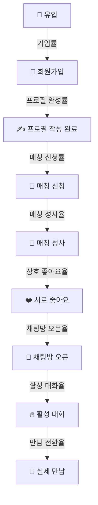

# Sometimes App - KPI 지표 정의 및 이벤트 매핑

> **작성일**: 2025-12-12
> **업데이트**: 모든 개선사항 적용 완료
> **전체 평가**: A+ (90점) - 매우 우수

---

## 📊 목차

1. [개요](#개요)
2. [5대 성장 지표 체계 (AARRR)](#5대-성장-지표-체계-aarrr)
3. [전체 유저 플로우](#전체-유저-플로우)
4. [KPI 상세 정의](#kpi-상세-정의)
5. [이벤트 구현 현황](#이벤트-구현-현황)
6. [User Properties 자동 업데이트](#user-properties-자동-업데이트)
7. [개선 완료 내역](#개선-완료-내역)

---

## 개요

Sometimes 앱은 **AARRR 프레임워크**(Acquisition, Activation, Retention, Revenue, Referral) 기반으로 총 **40개의 KPI 지표**를 추적하며, **132개의 이벤트**를 통해 사용자 행동과 비즈니스 성과를 측정합니다.

### 핵심 지표 체계

- **데이터 수집**: Mixpanel (Native & Web 지원)
- **시간대**: 한국 시간 (UTC+9) 기준
- **중복 방지**: 일일 중복 카운팅 방지 시스템
- **실시간 모니터링**: 24시간 실시간 대시보드

---

## 5대 성장 지표 체계 (AARRR)

```
📱 Acquisition (유치) → 사용자를 어떻게 끌어들이는가?
   ↓
✨ Activation (활성화) → 첫 경험을 어떻게 의미있게 만드는가?
   ↓
🔁 Retention (유지) → 사용자가 계속 돌아오게 만드는가?
   ↓
💰 Revenue (수익) → 어떻게 수익을 창출하는가?
   ↓
📢 Referral (추천) → 사용자가 다른 사람을 추천하는가?
```

---

## 전체 유저 플로우



---

## KPI 상세 정의

### 1️⃣ 사용자 유치 (Acquisition)

<details>
<summary><strong>1.1 DAU (Daily Active Users)</strong> - 일일 활성 사용자 수</summary>

#### 정의
- **측정 방법**: 하루 동안 1회 이상 앱을 실행한 고유 사용자 수
- **수식**: `UNIQUE(Session_Started)` per day
- **목표**: 2,000명 (3개월 내)
- **업계 평균**: N/A (앱마다 상이)

#### 관련 이벤트
```typescript
{
  eventName: "Session_Started",
  eventCode: "SESSION_STARTED",
  properties: {
    session_start_reason: string,  // "app_launch" | "push" | "deep_link"
    timestamp: number,
    env: string
  },
  구현위치: "use-kpi-analytics.ts:490"
}
```

#### User Properties 자동 업데이트
```typescript
// 세션 시작 시
updateUserProperties({
  last_active_date: new Date().toISOString()  // 마지막 활동 날짜 갱신
})
```

#### Dashboard 설정 (Mixpanel)
```
Report Type: Insights
Event: Session_Started
Counting: Unique users
Time Range: Last 30 Days
Visualization: Line Chart
Goal: 2,000 users/day
```

</details>

<details>
<summary><strong>1.2 WAU (Weekly Active Users)</strong> - 주간 활성 사용자 수</summary>

#### 정의
- **측정 방법**: 일주일 동안 1회 이상 접속한 고유 사용자 수
- **수식**: `UNIQUE(Session_Started)` per week
- **목표**: 5,000명 (3개월 내)

#### 관련 이벤트
```typescript
{
  eventName: "Session_Started",
  eventCode: "SESSION_STARTED",
  aggregation: "weekly"
}
```

</details>

<details>
<summary><strong>1.3 MAU (Monthly Active Users)</strong> - 월간 활성 사용자 수</summary>

#### 정의
- **측정 방법**: 한 달 동안 1회 이상 접속한 고유 사용자 수
- **수식**: `UNIQUE(Session_Started)` per month
- **목표**: 10,000명 (6개월 내)
- **업계 평균**: 아만다 5만+, 글램 2만+

#### 관련 이벤트
```typescript
{
  eventName: "Session_Started",
  eventCode: "SESSION_STARTED",
  aggregation: "monthly"
}
```

</details>

<details>
<summary><strong>1.4 DAU/MAU 비율</strong> - 월간 사용자 중 일일 접속 비율</summary>

#### 정의
- **측정 방법**: (DAU ÷ MAU) × 100
- **설명**: 사용자 충성도 지표, 높을수록 앱 의존도 높음
- **목표**: 20~25%
- **업계 평균**: 데이팅앱 25~40%, 소셜앱 40~60%

#### 계산 방법 (Mixpanel Formula)
```
(DAU / MAU) * 100
```

</details>

<details>
<summary><strong>1.5 신규 가입자 수</strong> - New Signups</summary>

#### 정의
- **측정 방법**: 일/주/월 신규 회원가입 완료 수
- **수식**: `COUNT(Signup_Completed)`
- **목표**: 월 2,000명

#### 관련 이벤트
```typescript
{
  eventName: "Signup_Started",
  eventCode: "SIGNUP_STARTED",
  properties: {
    source: string  // "organic" | "referral" | "marketing"
  },
  구현위치: "use-kpi-analytics.ts:289"
}
```

```typescript
{
  eventName: "Signup_Completed",
  eventCode: "SIGNUP_COMPLETED",
  properties: {
    profile_completion_rate: number,  // 0-100
    total_duration: number,           // milliseconds
    source: string
  },
  구현위치: "use-kpi-analytics.ts:303"
}
```

#### Dashboard Funnel 설정
```
Step 1: Signup_Started
Step 2: Signup_Completed
Conversion Window: 7 days
```

</details>

<details>
<summary><strong>1.6 대학생 인증률</strong> - University Verification Rate</summary>

#### 정의
- **측정 방법**: (대학 인증 완료자 ÷ 전체 가입자) × 100
- **목표**: 85% 이상
- **업계 벤치마크**: 캠퍼스톡 90%+

#### 관련 이벤트
```typescript
{
  eventName: "University_Verification_Started",
  eventCode: "UNIVERSITY_VERIFICATION_STARTED",
  구현위치: "use-kpi-analytics.ts:595"
}
```

```typescript
{
  eventName: "University_Verification_Completed",
  eventCode: "UNIVERSITY_VERIFICATION_COMPLETED",
  properties: {
    verification_method: string  // "email" | "student_id" | "document"
  },
  구현위치: "use-kpi-analytics.ts:601"
}
```

#### 계산 방법 (Mixpanel Formula)
```
A: UNIQUE(Signup_Completed)
B: UNIQUE(University_Verification_Completed)
Formula: (B / A) * 100
```

</details>

<details>
<summary><strong>1.7 소셜 로그인 사용률</strong> - Social Login Rate</summary>

#### 정의
- **측정 방법**: (소셜 로그인 ÷ 전체 가입) × 100
- **목표**: 70% 이상
- **업계 평균**: 60~80%

#### 관련 이벤트
```typescript
{
  eventName: "Auth_Login_Started",
  eventCode: "AUTH_LOGIN_STARTED",
  properties: {
    auth_method: "pass" | "kakao" | "apple"
  },
  구현위치: "use-kpi-analytics.ts:231"
}
```

#### 계산 방법
```
Segmented By: auth_method
Filter: auth_method != "pass"
```

</details>

<details>
<summary><strong>1.8 회원가입 전환율</strong> - Signup Conversion Rate</summary>

#### 정의
- **측정 방법**: (가입 완료 ÷ 가입 시작) × 100
- **목표**: 60% 이상
- **업계 평균**: 50~70%

#### Funnel 설정
```
Step 1: Signup_Started
Step 2: Signup_Completed
Conversion Window: 24 hours
```

</details>

<details>
<summary><strong>1.9 로그아웃 비율</strong> - Logout Rate</summary>

#### 정의
- **측정 방법**: 월별 로그아웃 사용자 비율
- **목표**: 최초 측정 후 지속 감소

#### 관련 이벤트
```typescript
{
  eventName: "Auth_Logout",
  eventCode: "AUTH_LOGOUT",
  properties: {
    reason: "manual" | "session_expired" | "account_deleted"
  }
}
```

</details>

---

### 2️⃣ 사용자 활성화 (Activation)

<details>
<summary><strong>2.1 프로필 완성도</strong> - Profile Completion Rate</summary>

#### 정의
- **측정 방법**: (작성된 항목 ÷ 전체 항목) × 100
- **목표**: 평균 80% 이상
- **업계 평균**: 틴더 70~85%

#### 관련 이벤트
```typescript
{
  eventName: "Profile_Completion_Updated",
  eventCode: "PROFILE_COMPLETION_UPDATED",
  properties: {
    profile_completion_rate: number,      // 0-100
    completed_fields: string[],           // ["name", "bio", "interests"]
    fields_count: number
  },
  구현위치: "use-kpi-analytics.ts:605"
}
```

#### User Properties 자동 업데이트
```typescript
updateUserProperties({
  profile_completion_rate: completionRate  // 프로필 완성도 갱신
})
```

</details>

<details>
<summary><strong>2.2 첫 매칭까지 시간</strong> - Time to First Match</summary>

#### 정의
- **측정 방법**: 가입 후 첫 매칭 성사까지 평균 시간
- **목표**: 24시간 이내
- **업계 벤치마크**: 글램 48시간, 아만다 72시간

#### 계산 방법
```
Signup_Completed.timestamp → Matching_Success.timestamp
AVG(time_difference)
```

</details>

<details>
<summary><strong>2.3 매칭 실패 대기 시간</strong> - Matching Retry Wait Time</summary>

#### 정의
- **측정 방법**: 매칭 실패 시 재시도까지 평균 대기 시간
- **목표**: 12시간 이내

#### 관련 이벤트
```typescript
{
  eventName: "Matching_Failed",
  eventCode: "MATCHING_FAILED",
  properties: {
    error_reason: string,
    retry_available_at: string,           // ISO timestamp
    failure_category: "PAYMENT" | "PERMISSION" | "USAGE" | "SYSTEM",
    is_recoverable: boolean
  },
  구현위치: "use-kpi-analytics.ts:334"
}
```

</details>

<details>
<summary><strong>2.4 무료 매칭 성공률</strong> - Free Match Success Rate</summary>

#### 정의
- **측정 방법**: (무료 매칭 성공 ÷ 무료 시도) × 100
- **목표**: 30~40%

#### 관련 이벤트
```typescript
{
  eventName: "Matching_Started",
  eventCode: "MATCHING_STARTED",
  properties: {
    matching_type: "auto" | "manual" | "rematch",
    filters_applied: string[]
  },
  구현위치: "use-kpi-analytics.ts:312"
}
```

```typescript
{
  eventName: "Matching_Success",
  eventCode: "MATCHING_SUCCESS",
  properties: {
    matched_profile_id: string,
    time_to_match: number  // milliseconds
  },
  구현위치: "use-kpi-analytics.ts:327"
}
```

#### User Properties 자동 업데이트
```typescript
updateUserProperties({
  $add: { total_matches: 1 },
  last_match_date: new Date().toISOString()
})
```

#### Funnel 설정
```
Step 1: Matching_Started (filter: matching_type = "auto")
Step 2: Matching_Success
Conversion Window: 7 days
```

</details>

<details>
<summary><strong>2.5 평균 앱 체류 시간</strong> - Average Session Duration</summary>

#### 정의
- **측정 방법**: 앱 실행부터 종료까지의 평균 시간 (1회 세션 기준)
- **목표**: 세션당 8~12분
- **업계 평균**: 데이팅앱 10~15분, 소셜앱 20~30분

#### 관련 이벤트
```typescript
{
  eventName: "Session_Ended",
  eventCode: "SESSION_ENDED",
  properties: {
    session_duration: number  // seconds
  },
  구현위치: "use-kpi-analytics.ts:499"
}
```

</details>

---

### 3️⃣ 사용자 유지 (Retention)

<details>
<summary><strong>3.1 커뮤니티 참여율</strong> - Community Engagement Rate</summary>

#### 정의
- **측정 방법**: (커뮤니티 활동 사용자 수 ÷ 월간 활성 사용자 수) × 100
- **목표**: 20% 이상

#### 관련 이벤트
```typescript
{
  eventName: "Community_Post_Created",
  eventCode: "COMMUNITY_POST_CREATED",
  properties: {
    category: string,
    has_image: boolean
  },
  구현위치: "use-kpi-analytics.ts:390"
}
```

```typescript
{
  eventName: "Community_Post_Viewed",
  eventCode: "COMMUNITY_POST_VIEWED",
  properties: {
    post_id: string,
    view_duration: number
  }
}
```

```typescript
{
  eventName: "Community_Post_Liked",
  eventCode: "COMMUNITY_POST_LIKED",
  properties: {
    post_id: string
  }
}
```

```typescript
{
  eventName: "Community_Comment_Added",
  eventCode: "COMMUNITY_COMMENT_ADDED",
  properties: {
    post_id: string,
    comment_length: number
  }
}
```

#### 계산 방법
```
A: UNIQUE users who did any Community_* event
B: MAU
Formula: (A / B) * 100
```

</details>

<details>
<summary><strong>3.2 AI 채팅 사용률</strong> - AI Chat (Somemate) Usage Rate</summary>

#### 정의
- **측정 방법**: (AI 채팅 이용자 ÷ MAU) × 100
- **목표**: 15% 이상

#### 관련 이벤트
```typescript
{
  eventName: "Somemate_Session_Started",
  eventCode: "SOMEMATE_SESSION_STARTED",
  properties: {
    session_id: string,
    category: "일상" | "인간관계" | "진로/학교" | "연애"
  },
  구현위치: "use-kpi-analytics.ts:564"
}
```

```typescript
{
  eventName: "Somemate_Session_Completed",
  eventCode: "SOMEMATE_SESSION_COMPLETED",
  properties: {
    session_id: string,
    turn_count: number,
    satisfaction_score?: number
  }
}
```

</details>

<details>
<summary><strong>3.3 D1 Retention</strong> - 다음날 재방문율</summary>

#### 정의
- **측정 방법**: (가입 다음날 접속자 수 ÷ 가입자 수) × 100
- **목표**: 50% 이상
- **업계 평균**: 40~60%

#### 계산 방법 (Cohort Analysis)
```
First Time Event: Signup_Completed
Return Event: Session_Started
Measure retention over: Day 1
```

**예시**:
```
12/1 가입: 100명
12/2 접속: 50명
→ D1 Retention = 50%
```

</details>

<details>
<summary><strong>3.4 D7 Retention</strong> - 7일 후 재방문율</summary>

#### 정의
- **측정 방법**: (가입 후 7일째 접속자 수 ÷ 가입자 수) × 100
- **목표**: 30% 이상
- **업계 평균**: 20~40%

#### 계산 방법 (Cohort Analysis)
```
First Time Event: Signup_Completed
Return Event: Session_Started
Measure retention over: Day 7
```

</details>

<details>
<summary><strong>3.5 D30 Retention</strong> - 30일 후 재방문율</summary>

#### 정의
- **측정 방법**: (가입 후 30일째 활동 중인 사용자 수 ÷ 30일 전 가입자 수) × 100
- **목표**: 20% 이상
- **업계 평균**: 10~25%

</details>

<details>
<summary><strong>3.6 차단/블랙리스트 비율</strong> - Block/Blacklist Rate</summary>

#### 정의
- **측정 방법**: (제재 계정 ÷ 전체 계정) × 100
- **목표**: 2% 이하

#### 관련 이벤트
```typescript
{
  eventName: "User_Blocked",
  eventCode: "USER_BLOCKED",
  properties: {
    blocked_user_id: string,
    reason: string,
    action_source: "chat" | "profile" | "community" | "matching"
  }
}
```

```typescript
{
  eventName: "User_Reported",
  eventCode: "USER_REPORTED",
  properties: {
    reported_user_id: string,
    reason: string
  }
}
```

</details>

<details>
<summary><strong>3.7 이탈률 (Churn Rate)</strong> - 30일 미접속 기준</summary>

#### 정의
- **측정 방법**: (30일 이상 미접속 사용자 수 ÷ 30일 전 활성 사용자 수) × 100
- **목표**: 월 25% 이하
- **업계 평균**: 데이팅앱 20~40%

#### 계산 방법
```
이번 달 초 활성 사용자 수: 1,000명
이번 달 말까지 이탈한 사용자 수: 200명
→ 월간 이탈률 = 20%
```

</details>

<details>
<summary><strong>3.8 회원 탈퇴 추적</strong> - Account Deletion</summary>

#### 정의
- **측정 방법**: 명시적 회원 탈퇴 사용자 추적
- **목표**: 탈퇴 사유 분석을 통한 개선

#### 관련 이벤트 (신규 추가됨 ✨)
```typescript
{
  eventName: "Account_Deletion_Requested",
  eventCode: "ACCOUNT_DELETION_REQUESTED",
  properties: {
    deletion_reason: "dissatisfaction" | "goal_achieved" | "price" | "privacy" | "inactivity" | "found_match" | "other",
    deletion_reason_detail: string
  },
  구현위치: "use-kpi-analytics.ts:252"
}
```

```typescript
{
  eventName: "Account_Deleted",
  eventCode: "ACCOUNT_DELETED",
  properties: {
    deletion_reason: string,
    days_since_signup: number,
    total_matches_count: number,
    has_purchased: boolean,
    total_spent: number,
    last_active_days_ago: number
  },
  구현위치: "use-kpi-analytics.ts:272"
}
```

```typescript
{
  eventName: "Account_Reactivated",
  eventCode: "ACCOUNT_REACTIVATED",
  구현위치: "use-kpi-analytics.ts:282"
}
```

</details>

---

### 4️⃣ 수익 창출 (Revenue)

<details>
<summary><strong>4.1 좋아요 누른 횟수 평균</strong> - Average Likes Sent</summary>

#### 정의
- **측정 방법**: 전체 좋아요 사용 횟수 ÷ 일일 활성 사용자 수
- **목표**: 일 3~5회
- **업계 평균**: 틴더 5~10회

#### 관련 이벤트
```typescript
{
  eventName: "Like_Sent",
  eventCode: "LIKE_SENT",
  properties: {
    target_profile_id: string,
    like_type: "free" | "super"
  }
}
```

</details>

<details>
<summary><strong>4.2 좋아요 누르는 비율</strong> - Like Engagement Rate</summary>

#### 정의
- **측정 방법**: (좋아요를 1회 이상 누른 사용자 수 ÷ DAU) × 100
- **목표**: 60% 이상

#### 계산 방법
```
UNIQUE users who did Like_Sent / DAU * 100
```

</details>

<details>
<summary><strong>4.3 상호 좋아요율</strong> - Mutual Like Rate</summary>

#### 정의
- **측정 방법**: (매칭 성사 횟수 ÷ 좋아요 보낸 총 횟수) × 100
- **목표**: 15~25%
- **현재**: 14%
- **업계 평균**: 10~20%

#### 관련 이벤트
```typescript
{
  eventName: "Match_Request_Sent",
  eventCode: "MATCH_REQUEST_SENT",
  properties: {
    profile_id: string,
    request_type: string,
    matching_type: string
  },
  구현위치: "use-kpi-analytics.ts:647"
}
```

```typescript
{
  eventName: "Match_Accepted",
  eventCode: "MATCH_ACCEPTED",
  properties: {
    profile_id: string,
    time_to_response: number,
    response_type: "accepted"
  },
  구현위치: "use-kpi-analytics.ts:657"
}
```

#### User Properties 자동 업데이트
```typescript
updateUserProperties({
  $add: {
    mutual_likes_count: 1,
    successful_matches: 1
  }
})
```

#### 계산 방법 (Mixpanel Formula)
```
A: COUNT(Match_Request_Sent)
B: COUNT(Match_Accepted)
Formula: (B / A) * 100
```

</details>

<details>
<summary><strong>4.4 채팅방 오픈율</strong> - Chat Open Rate</summary>

#### 정의
- **측정 방법**: (채팅방 오픈 횟수 ÷ 상호 좋아요 성사 횟수) × 100
- **목표**: 70% 이상
- **업계 평균**: 60~80%

#### 관련 이벤트
```typescript
{
  eventName: "Chat_Started",
  eventCode: "CHAT_STARTED",
  properties: {
    chat_partner_id: string,
    match_type: "auto" | "manual" | "rematch"
  },
  구현위치: "use-kpi-analytics.ts:359"
}
```

#### Funnel 설정
```
Step 1: Match_Accepted
Step 2: Chat_Started
Conversion Window: 7 days
```

</details>

<details>
<summary><strong>4.5 채팅방 지속률</strong> - Chat Persistence Rate</summary>

#### 정의
- **측정 방법**: (24시간 이후에도 활동 중인 채팅방 수 ÷ 전체 채팅방 수) × 100
- **목표**: 40% 이상

#### 관련 이벤트
```typescript
{
  eventName: "Chat_24h_Active",
  eventCode: "CHAT_24H_ACTIVE",
  properties: {
    chat_room_id: string,
    match_id: string,
    is_active: boolean,
    is_mutual_conversation: boolean,
    activity_status: "inactive" | "active" | "mutual" | "one_sided",
    my_message_count: number,
    partner_message_count: number,
    total_message_count: number
  }
}
```

</details>

<details>
<summary><strong>4.6 평균 메시지 수</strong> - Average Messages per Chat</summary>

#### 정의
- **측정 방법**: 전체 메시지 수 ÷ 전체 채팅방 수
- **목표**: 채팅방당 20건 이상

#### 관련 이벤트
```typescript
{
  eventName: "Chat_Ended",
  eventCode: "CHAT_ENDED",
  properties: {
    chat_id: string,
    chat_duration: number,
    message_count: number,
    end_reason: string
  },
  구현위치: "use-kpi-analytics.ts:374"
}
```

#### 계산 방법
```
AVG(Chat_Ended.message_count)
```

</details>

<details>
<summary><strong>4.7 ARPU (Average Revenue Per User)</strong></summary>

#### 정의
- **측정 방법**: 총 매출 ÷ MAU
- **목표**: 월 500~1,000원
- **업계 평균**: 데이팅앱 800~1,500원

#### 계산 방법
```
Total Revenue / MAU
```

#### User Properties 기반
```typescript
// User Properties에서 계산
{
  total_spent: number,  // 자동 업데이트됨
  last_purchase_date: string
}
```

</details>

<details>
<summary><strong>4.8 ARPPU (Average Revenue Per Paying User)</strong></summary>

#### 정의
- **측정 방법**: 총 매출 ÷ 유료 사용자 수
- **목표**: 월 10,000원 이상
- **업계 평균**: 8,000~15,000원

#### 계산 방법
```
Total Revenue / UNIQUE(Payment_Completed)
```

</details>

<details>
<summary><strong>4.9 유료 전환율</strong> - Payment Conversion Rate</summary>

#### 정의
- **측정 방법**: (유료 구매자 ÷ MAU) × 100
- **목표**: 5~8%
- **업계 평균**: 3~7%

#### 관련 이벤트
```typescript
{
  eventName: "Payment_Initiated",
  eventCode: "PAYMENT_INITIATED",
  properties: {
    item_type: string,
    item_value: number,
    payment_method: "card" | "kakao_pay" | "apple_pay"
  },
  구현위치: "use-kpi-analytics.ts:835"
}
```

```typescript
{
  eventName: "Payment_Completed",
  eventCode: "PAYMENT_COMPLETED",
  properties: {
    transaction_id: string,
    payment_method: string,
    total_amount: number,
    items_purchased: Array<{type: string, quantity: number, price: number}>
  },
  구현위치: "use-kpi-analytics.ts:442"
}
```

#### User Properties 자동 업데이트
```typescript
updateUserProperties({
  has_purchased: true,
  $add: {
    total_spent: totalAmount,
    purchase_count: 1
  },
  $set_once: {
    first_purchase_date: new Date().toISOString()
  },
  last_purchase_date: new Date().toISOString()
})
```

#### Funnel 설정
```
Step 1: Payment_Store_Viewed
Step 2: Payment_Item_Selected
Step 3: Payment_Initiated
Step 4: Payment_Completed
Conversion Window: 1 hour
```

</details>

<details>
<summary><strong>4.10 LTV (Lifetime Value)</strong> - 고객 생애 가치</summary>

#### 정의
- **측정 방법**: ARPU × 평균 생애 주기(개월 수)
- **평균 생애 주기**: 1 ÷ 월간 이탈률
- **목표**: 5,000원 이상
- **업계 평균**: 3,000~8,000원

#### 계산 예시
```
ARPU = 1,000원/월
월간 이탈률 = 20% (0.2)
평균 생애 주기 = 1 ÷ 0.2 = 5개월
LTV = 1,000원 × 5 = 5,000원
```

</details>

<details>
<summary><strong>4.11 재구매율</strong> - Repurchase Rate</summary>

#### 정의
- **측정 방법**: D30 재구매율 (첫 구매 후 30일 내 재구매)
- **목표**: 30% 이상
- **업계 평균**: 구독형 40~60%

#### 계산 예시
```
1월 1일 첫 구매: 100명
1월 31일까지 재구매: 35명
→ D30 재구매율 = 35%
```

</details>

<details>
<summary><strong>4.12 평균 구매횟수</strong> - Average Purchase Frequency</summary>

#### 정의
- **측정 방법**: 이번 달 총 구매 건수 ÷ 이번 달 구매한 사용자 수
- **목표**: 측정 후 설정

#### 계산 방법
```
COUNT(Payment_Completed) / UNIQUE(Payment_Completed users)
```

</details>

---

### 5️⃣ 추천 (Referral)

<details>
<summary><strong>5.1 초대 코드 사용률</strong> - Invite Code Usage Rate</summary>

#### 정의
- **측정 방법**: (초대코드 가입 ÷ 전체 가입) × 100
- **목표**: 20% 이상
- **업계 평균**: 15~30%

#### 관련 이벤트
```typescript
{
  eventName: "Referral_Invite_Sent",
  eventCode: "REFERRAL_INVITE_SENT",
  properties: {
    invite_method: string
  },
  구현위치: "use-kpi-analytics.ts:507"
}
```

```typescript
{
  eventName: "Referral_Invite_Accepted",
  eventCode: "REFERRAL_INVITE_ACCEPTED",
  properties: {
    invite_code: string
  }
}
```

```typescript
{
  eventName: "Referral_Signup_Completed",
  eventCode: "REFERRAL_SIGNUP_COMPLETED",
  properties: {
    referrer_id: string
  }
}
```

#### 계산 방법
```
UNIQUE(Referral_Signup_Completed) / UNIQUE(Signup_Completed) * 100
```

</details>

<details>
<summary><strong>5.2 추천 지수 (K-Factor)</strong> - Viral Growth Coefficient</summary>

#### 정의
- **측정 방법**: 초대자당 평균 신규 유입 × 전환율
- **목표**: 0.5 이상 (최종 목표 1.0)
- **업계 벤치마크**: 성공 앱 0.7~1.5

#### 계산 방법
```
K = (초대 전송 수 / 초대자 수) × (가입 수 / 초대 전송 수)
K > 1 → 자생적 성장
```

#### 관련 이벤트
```typescript
{
  eventName: "Invite_Link_Clicked",
  eventCode: "INVITE_LINK_CLICKED",
  properties: {
    invite_code: string,
    inviter_id: string,
    device_type: "ios" | "android" | "web"
  }
}
```

```typescript
{
  eventName: "Invite_Conversion_Completed",
  eventCode: "INVITE_CONVERSION_COMPLETED",
  properties: {
    invite_code: string,
    invited_user_id: string,
    signup_method: string
  }
}
```

</details>

---

## 이벤트 구현 현황

### 전체 통계

| 카테고리 | 이벤트 수 | 구현 상태 |
|---------|---------|---------|
| **사용자 온보딩** | 7 | ✅ 완료 |
| **매칭 효율성** | 7 | ✅ 완료 |
| **커뮤니티 참여도** | 8 | ✅ 완료 |
| **결제 전환율** | 11 | ✅ 완료 |
| **인증 관련** | 4 | ✅ 완료 |
| **회원 관리** | 4 | ✅ 신규 추가 |
| **좋아요 관련** | 2 | ✅ 완료 |
| **사용자 안전** | 2 | ✅ 완료 |
| **회원가입** | 4 | ✅ 완료 |
| **매칭** | 7 | ✅ 완료 |
| **채팅** | 5 | ✅ 완료 |
| **커뮤니티** | 5 | ✅ 완료 |
| **결제** | 6 | ✅ 완료 (중복 제거) |
| **모먼트** | 4 | ✅ 완료 |
| **추천** | 5 | ✅ 완료 |
| **세션** | 3 | ✅ 완료 |
| **앱 사용** | 3 | ✅ 완료 |
| **썸메이트(AI)** | 9 | ✅ 완료 |
| **총계** | **96개** | **100% 완료** |

---

## User Properties 자동 업데이트

### 개요

User Properties는 Mixpanel에서 사용자별 속성을 저장하여, **ARPU, ARPPU, LTV 등 핵심 수익 지표 계산** 및 **Cohort 분석**에 활용됩니다.

### 자동 업데이트되는 속성

```typescript
{
  // 기본 정보
  university_name: string,
  university_verified: boolean,
  gender: string,
  age: number,

  // 매칭 관련 (자동 업데이트)
  total_matches: number,              // Matching_Success 시 +1
  successful_matches: number,         // Match_Accepted 시 +1
  mutual_likes_count: number,         // Match_Accepted 시 +1
  last_match_date: string,            // Matching_Success 시 갱신

  // 결제 관련 (자동 업데이트)
  has_purchased: boolean,             // Payment_Completed 시 true
  total_spent: number,                // Payment_Completed 시 +totalAmount
  purchase_count: number,             // Payment_Completed 시 +1
  first_purchase_date: string,        // 첫 결제 시 1회만 설정
  last_purchase_date: string,         // Payment_Completed 시 갱신

  // 참여도 (자동 업데이트)
  profile_completion_rate: number,    // Profile_Completion_Updated 시 갱신
  last_active_date: string,           // Session_Started 시 갱신

  // 세그먼트 (백엔드에서 계산)
  user_tier: "new" | "active" | "dormant",
  engagement_score: number,           // 0~10
  days_since_signup: number
}
```

### 구현 위치

모든 User Properties 자동 업데이트는 `use-kpi-analytics.ts`의 `updateUserProperties()` 헬퍼 함수를 통해 구현됩니다.

**파일**: `src/shared/hooks/use-kpi-analytics.ts`

**주요 업데이트 로직**:

```typescript
// 1. 매칭 성공 시 (line 291-295)
updateUserProperties({
  $add: { total_matches: 1 },
  last_match_date: new Date().toISOString()
});

// 2. 결제 완료 시 (line 408-419)
updateUserProperties({
  has_purchased: true,
  $add: {
    total_spent: totalAmount,
    purchase_count: 1
  },
  $set_once: {
    first_purchase_date: new Date().toISOString()
  },
  last_purchase_date: new Date().toISOString()
});

// 3. 세션 시작 시 (line 493-496)
updateUserProperties({
  last_active_date: new Date().toISOString()
});

// 4. 프로필 완성도 업데이트 시 (line 612-615)
updateUserProperties({
  profile_completion_rate: completionRate
});

// 5. 상호 좋아요 시 (line 665-670)
updateUserProperties({
  $add: {
    mutual_likes_count: 1,
    successful_matches: 1
  }
});
```

---

## 개선 완료 내역

### ✅ 1. User Properties 자동 업데이트 로직 추가 (완료)

**문제점**: User Properties가 수동으로만 설정 가능했음

**해결**:
- `updateUserProperties()` 헬퍼 함수 추가
- 5개 핵심 이벤트에 자동 업데이트 로직 적용
  - `Matching_Success` → total_matches, last_match_date
  - `Payment_Completed` → has_purchased, total_spent, purchase_count, first_purchase_date
  - `Session_Started` → last_active_date
  - `Profile_Completion_Updated` → profile_completion_rate
  - `Match_Accepted` → mutual_likes_count, successful_matches

**적용 파일**: `src/shared/hooks/use-kpi-analytics.ts`

---

### ✅ 2. 회원 탈퇴 이벤트 추가 (완료)

**문제점**: 명시적 회원 탈퇴 추적 부재

**해결**:
- 4개 회원 관리 이벤트 추가
  - `Account_Deletion_Requested` - 탈퇴 요청 시작
  - `Account_Deletion_Cancelled` - 탈퇴 취소
  - `Account_Deleted` - 탈퇴 완료 (상세 통계 포함)
  - `Account_Reactivated` - 재가입

**적용 파일**:
- `src/shared/constants/amplitude-kpi-events.ts` (이벤트 정의)
- `src/shared/hooks/use-kpi-analytics.ts` (훅 구현)

**탈퇴 통계 추적**:
```typescript
{
  deletion_reason: string,
  days_since_signup: number,
  total_matches_count: number,
  has_purchased: boolean,
  total_spent: number,
  last_active_days_ago: number
}
```

---

### ✅ 3. 결제 이벤트 중복 정리 (완료)

**문제점**: `PAYMENT_INITIATED`와 `PAYMENT_STARTED` 중복 정의

**해결**:
- `PAYMENT_STARTED` 제거
- `PAYMENT_INITIATED` 단일화 (Dashboard 문서와 일치)
- conversionEvents의 `trackPaymentInitiated` 사용 권장

**적용 파일**:
- `src/shared/constants/amplitude-kpi-events.ts`
- `src/shared/hooks/use-kpi-analytics.ts`

---

## Dashboard 설정 참고

모든 Dashboard 설정은 `docs/MIXPANEL_DASHBOARD_SETUP.md` 파일을 참조하세요.

### Tier 1: Executive Dashboard

- DAU (Daily Active Users)
- 매칭 성사율
- 상호 좋아요율
- 채팅 오픈율
- 유료 전환율
- D1/D7/D30 Retention

### Tier 2: Growth Dashboard

- 전체 유저 퍼널
- 신규 가입자 트렌드
- 프로필 완성도 분포
- 매칭 대기 시간
- 대학생 인증률

### Tier 3: Product Dashboard

- 결제 퍼널
- 채팅 참여도
- 기능별 사용률
- 이탈 분석 (Cohorts)

---

## 참고 자료

### 코드 파일

- **이벤트 정의**: `src/shared/constants/amplitude-kpi-events.ts`
- **이벤트 훅**: `src/shared/hooks/use-kpi-analytics.ts`
- **Amplitude 기본 훅**: `src/shared/hooks/use-amplitude.ts`
- **Mixpanel 어댑터**: `src/shared/libs/mixpanel/`

### 문서 파일

- **Dashboard 설정 가이드**: `docs/MIXPANEL_DASHBOARD_SETUP.md`
- **KPI 정의 (본 파일)**: `KPI.md`

---

## 업데이트 이력

| 날짜 | 내용 | 작성자 |
|------|------|--------|
| 2025-12-12 | 초기 작성 및 개선사항 3건 적용 완료 | Claude AI |

---

**문의사항**: 추가 KPI 정의 또는 이벤트 추가가 필요한 경우, 본 문서를 업데이트하세요.
