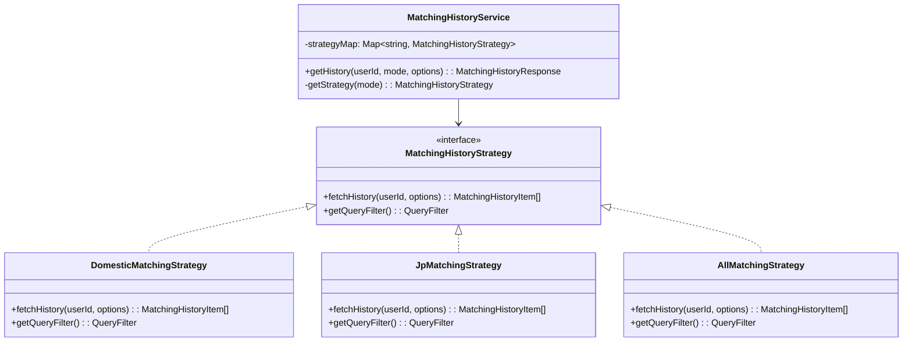
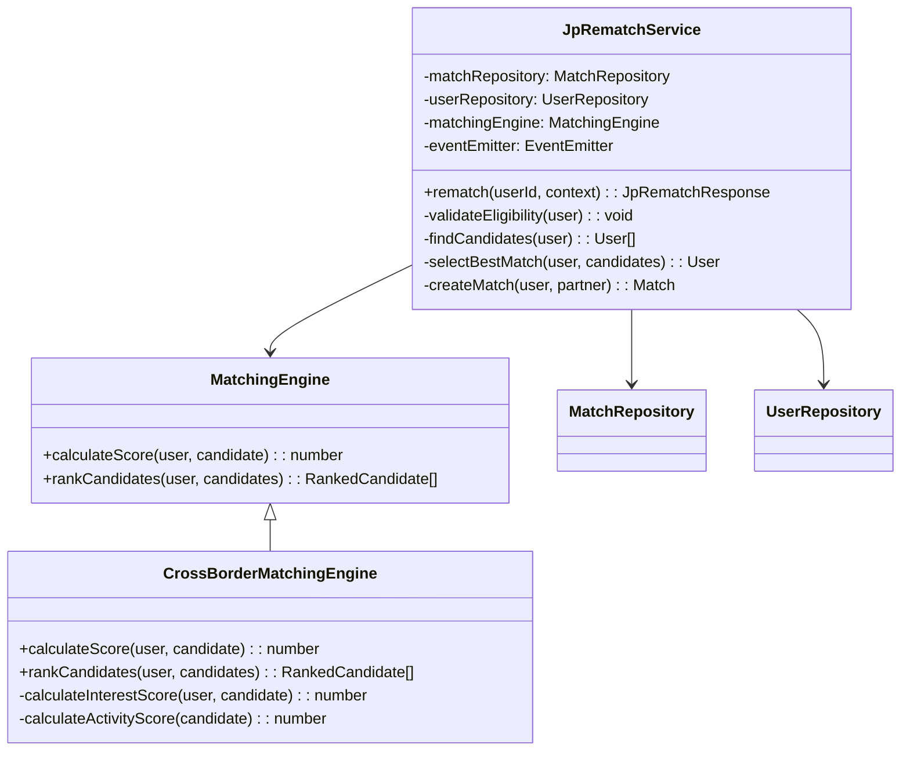

# 한일 매칭 BE API 스펙 문서

> **작성일**: 2026-01-28
> **버전**: 1.0
> **상태**: Draft

---

## 1. 개요

### 1.1 목적
한일 매칭 기능 구현을 위한 백엔드 API 명세 및 아키텍처 설계 문서

### 1.2 주요 작업 항목

| 작업 | 설명 | 우선순위 |
|-----|-----|---------|
| 매칭 모드 관리 API | 유저별 매칭 모드 조회/전환 | P0 |
| JP 매칭 자격 조회 API | JP SMS 인증 상태 확인 | P0 |
| JP 재매칭 API | 한일 매칭 전용 재매칭 | P0 |
| 매칭 내역 API 수정 | mode 파라미터 추가 (OOP 패턴) | P1 |
| 유저 프로필 스키마 수정 | matchingMode 필드 추가 | P0 |

---

## 2. 데이터 모델

### 2.1 User 스키마 수정

```typescript
// 기존 User 모델에 추가할 필드

interface User {
  // ... 기존 필드 ...

  /** 현재 매칭 모드 */
  matchingMode: 'DOMESTIC' | 'JP';

  /** JP 매칭 자격 정보 */
  jpMatchingEligibility: {
    /** JP SMS 인증 완료 여부 */
    jpSmsVerified: boolean;
    /** 인증 완료 일시 */
    verifiedAt: Date | null;
    /** 인증된 일본 전화번호 (마스킹) */
    jpPhoneNumber: string | null;
  };

  /** 마지막 모드 변경 일시 */
  lastModeChangedAt: Date | null;
}
```

### 2.2 Match 스키마 수정

```typescript
// 기존 Match 모델에 추가할 필드

interface Match {
  // ... 기존 필드 ...

  /** 매칭 모드 */
  matchingMode: 'DOMESTIC' | 'JP';

  /** 매칭된 유저의 국적 */
  partnerNationality: 'KR' | 'JP';
}
```

### 2.3 Enum 정의

```typescript
enum MatchingMode {
  DOMESTIC = 'DOMESTIC',  // 국내 매칭
  JP = 'JP'               // 한일 매칭
}

enum Nationality {
  KR = 'KR',  // 한국
  JP = 'JP'   // 일본
}
```

---

## 3. API 명세

### 3.1 매칭 모드 조회

#### `GET /v1/user/matching-mode`

현재 유저의 매칭 모드 상태를 조회합니다.

**Request**
```http
GET /v1/user/matching-mode
Authorization: Bearer {token}
```

**Response**
```typescript
interface MatchingModeResponse {
  /** 현재 활성 모드 */
  currentMode: 'DOMESTIC' | 'JP';

  /** JP 모드 사용 가능 여부 */
  jpModeAvailable: boolean;

  /** 마지막 모드 변경 일시 */
  lastChangedAt: string | null;
}
```

**Response Example**
```json
{
  "currentMode": "DOMESTIC",
  "jpModeAvailable": true,
  "lastChangedAt": "2026-01-28T10:30:00Z"
}
```

**Error Responses**
| Status | Code | Message |
|--------|------|---------|
| 401 | UNAUTHORIZED | 인증이 필요합니다 |
| 500 | INTERNAL_ERROR | 서버 오류가 발생했습니다 |

---

### 3.2 매칭 모드 전환

#### `POST /v1/user/matching-mode`

유저의 매칭 모드를 전환합니다.

**Request**
```http
POST /v1/user/matching-mode
Authorization: Bearer {token}
Content-Type: application/json
```

```typescript
interface SwitchModeRequest {
  mode: 'DOMESTIC' | 'JP';
}
```

**Request Example**
```json
{
  "mode": "JP"
}
```

**Response**
```typescript
interface SwitchModeResponse {
  success: boolean;
  currentMode: 'DOMESTIC' | 'JP';
  message?: string;
}
```

**Response Example**
```json
{
  "success": true,
  "currentMode": "JP",
  "message": null
}
```

**Error Responses**
| Status | Code | Message |
|--------|------|---------|
| 400 | INVALID_MODE | 유효하지 않은 모드입니다 |
| 403 | JP_NOT_ELIGIBLE | JP 매칭 자격이 없습니다 |
| 401 | UNAUTHORIZED | 인증이 필요합니다 |

**비즈니스 로직**
```
1. 요청된 mode 유효성 검증
2. JP 모드 요청 시:
   - jpMatchingEligibility.jpSmsVerified 확인
   - false인 경우 JP_NOT_ELIGIBLE 에러 반환
3. User.matchingMode 업데이트
4. User.lastModeChangedAt 업데이트
5. Mixpanel 이벤트 전송: Mode_Switched
```

---

### 3.3 JP 매칭 자격 조회

#### `GET /v1/user/jp-matching/eligibility`

유저의 JP 매칭 자격 상태를 조회합니다.

**Request**
```http
GET /v1/user/jp-matching/eligibility
Authorization: Bearer {token}
```

**Response**
```typescript
interface JpEligibilityResponse {
  /** JP 매칭 가능 여부 */
  eligible: boolean;

  /** JP SMS 인증 완료 여부 */
  jpSmsVerified: boolean;

  /** 인증 완료 일시 */
  verifiedAt: string | null;

  /** 인증된 전화번호 (마스킹: +81-90-****-1234) */
  maskedPhoneNumber: string | null;
}
```

**Response Example**
```json
{
  "eligible": true,
  "jpSmsVerified": true,
  "verifiedAt": "2026-01-15T09:00:00Z",
  "maskedPhoneNumber": "+81-90-****-1234"
}
```

---

### 3.4 JP 재매칭 API

#### `POST /v3/matching/rematch/jp`

한일 매칭 전용 재매칭을 수행합니다.

**Request**
```http
POST /v3/matching/rematch/jp
Authorization: Bearer {token}
Content-Type: application/json
```

```typescript
interface JpRematchRequest {
  /** 매칭 컨텍스트 (선택) */
  context?: {
    previousMatchAttempts?: number;
  };
}
```

**Request Example**
```json
{
  "context": {
    "previousMatchAttempts": 2
  }
}
```

**Response - 성공**
```typescript
interface JpRematchSuccessResponse {
  matchId: string;
  match: {
    userId: string;
    nickname: string;
    age: number;
    profileImage: string;
    nationality: 'KR' | 'JP';
    region: string;
    bio?: string;
    interests?: string[];
    commonInterests?: string[];
  };
  canLetter: boolean;
}
```

**Response Example - 성공**
```json
{
  "matchId": "match_abc123",
  "match": {
    "userId": "user_xyz789",
    "nickname": "Yuki",
    "age": 24,
    "profileImage": "https://cdn.example.com/profile/xyz789.jpg",
    "nationality": "JP",
    "region": "Tokyo",
    "bio": "K-POP과 한국 문화에 관심이 많아요",
    "interests": ["K-POP", "여행", "영화"],
    "commonInterests": ["K-POP", "여행"]
  },
  "canLetter": true
}
```

**Response - 매칭 상대 없음**
```typescript
interface JpRematchEmptyResponse {
  error: 'USER_NOT_FOUND';
  message: string;
}
```

**Response Example - 매칭 상대 없음**
```json
{
  "error": "USER_NOT_FOUND",
  "message": "현재 매칭 가능한 상대가 없습니다"
}
```

**Error Responses**
| Status | Code | Message |
|--------|------|---------|
| 200 | USER_NOT_FOUND | 현재 매칭 가능한 상대가 없습니다 |
| 403 | NOT_ELIGIBLE | JP 매칭 자격이 없습니다 |
| 403 | WRONG_MODE | 현재 JP 모드가 아닙니다 |
| 429 | RATE_LIMITED | 요청이 너무 많습니다 |
| 401 | UNAUTHORIZED | 인증이 필요합니다 |

**비즈니스 로직**
```
1. 유저 JP 매칭 자격 확인 (jpSmsVerified)
2. 현재 매칭 모드 확인 (JP 모드 여부)
3. 유저 국적 확인:
   - 한국인(KR) → 일본인 풀에서 매칭
   - 일본인(JP) → 한국인 풀에서 매칭
4. 매칭 알고리즘 실행:
   - 상대국 유저 중 JP/KR 모드 활성화된 유저만 대상
   - 기존 매칭 제외
   - 관심사 기반 점수 계산
5. 매칭 성공 시:
   - Match 레코드 생성 (matchingMode: JP)
   - Mixpanel 이벤트: JP_Match_Created
6. 매칭 실패 시:
   - USER_NOT_FOUND 응답
   - Mixpanel 이벤트: JP_Match_Empty
```

---

### 3.5 매칭 내역 조회 API (수정)

#### `GET /v2/matching/history/list`

매칭 내역을 조회합니다. **mode 파라미터 추가**

**Request**
```http
GET /v2/matching/history/list?mode=JP
Authorization: Bearer {token}
```

**Query Parameters**
| Parameter | Type | Required | Default | Description |
|-----------|------|----------|---------|-------------|
| mode | string | No | 현재 활성 모드 | `DOMESTIC`, `JP`, `ALL` |
| limit | number | No | 20 | 조회 개수 |
| offset | number | No | 0 | 시작 위치 |

**Response**
```typescript
interface MatchingHistoryResponse {
  items: MatchingHistoryItem[];
  total: number;
  hasMore: boolean;
}

interface MatchingHistoryItem {
  matchId: string;
  blinded: boolean;
  imageUrl: string;
  deletedAt: string | null;
  age: number;
  mbti: string;
  universityName: string;
  universityAuthentication: boolean;
  someReceived: boolean;
  connectionId: string;
  lastLogin: string | null;
  /** 매칭 모드 (신규) */
  matchingMode: 'DOMESTIC' | 'JP';
  /** 상대방 국적 (신규) */
  nationality: 'KR' | 'JP';
}
```

**Response Example**
```json
{
  "items": [
    {
      "matchId": "match_abc123",
      "blinded": false,
      "imageUrl": "https://cdn.example.com/profile/xyz.jpg",
      "deletedAt": null,
      "age": 24,
      "mbti": "ENFP",
      "universityName": "도쿄대학교",
      "universityAuthentication": true,
      "someReceived": false,
      "connectionId": "conn_123",
      "lastLogin": "2026-01-28T10:00:00Z",
      "matchingMode": "JP",
      "nationality": "JP"
    }
  ],
  "total": 15,
  "hasMore": true
}
```

---

## 4. OOP 패턴 설계 (매칭 내역 API)

### 4.1 전략 패턴 구조



### 4.2 구현 예시 (TypeScript/NestJS)

```typescript
// matching-history-strategy.interface.ts
export interface MatchingHistoryStrategy {
  fetchHistory(
    userId: string,
    options: HistoryQueryOptions
  ): Promise<MatchingHistoryItem[]>;

  getQueryFilter(): Record<string, any>;
}

// domestic-matching.strategy.ts
@Injectable()
export class DomesticMatchingStrategy implements MatchingHistoryStrategy {
  constructor(private readonly matchRepository: MatchRepository) {}

  async fetchHistory(
    userId: string,
    options: HistoryQueryOptions
  ): Promise<MatchingHistoryItem[]> {
    const filter = this.getQueryFilter();

    return this.matchRepository.findByUserId(userId, {
      ...filter,
      limit: options.limit,
      offset: options.offset,
    });
  }

  getQueryFilter(): Record<string, any> {
    return {
      matchingMode: MatchingMode.DOMESTIC,
    };
  }
}

// jp-matching.strategy.ts
@Injectable()
export class JpMatchingStrategy implements MatchingHistoryStrategy {
  constructor(private readonly matchRepository: MatchRepository) {}

  async fetchHistory(
    userId: string,
    options: HistoryQueryOptions
  ): Promise<MatchingHistoryItem[]> {
    const filter = this.getQueryFilter();

    return this.matchRepository.findByUserId(userId, {
      ...filter,
      limit: options.limit,
      offset: options.offset,
    });
  }

  getQueryFilter(): Record<string, any> {
    return {
      matchingMode: MatchingMode.JP,
    };
  }
}

// all-matching.strategy.ts
@Injectable()
export class AllMatchingStrategy implements MatchingHistoryStrategy {
  constructor(private readonly matchRepository: MatchRepository) {}

  async fetchHistory(
    userId: string,
    options: HistoryQueryOptions
  ): Promise<MatchingHistoryItem[]> {
    // 모든 모드 조회 (필터 없음)
    return this.matchRepository.findByUserId(userId, {
      limit: options.limit,
      offset: options.offset,
    });
  }

  getQueryFilter(): Record<string, any> {
    return {}; // 필터 없음
  }
}

// matching-history.service.ts
@Injectable()
export class MatchingHistoryService {
  private readonly strategyMap: Map<string, MatchingHistoryStrategy>;

  constructor(
    private readonly domesticStrategy: DomesticMatchingStrategy,
    private readonly jpStrategy: JpMatchingStrategy,
    private readonly allStrategy: AllMatchingStrategy,
    private readonly userService: UserService,
  ) {
    this.strategyMap = new Map([
      [MatchingMode.DOMESTIC, this.domesticStrategy],
      [MatchingMode.JP, this.jpStrategy],
      ['ALL', this.allStrategy],
    ]);
  }

  async getHistory(
    userId: string,
    mode?: string,
    options?: HistoryQueryOptions
  ): Promise<MatchingHistoryResponse> {
    // mode가 없으면 현재 유저의 활성 모드 사용
    const effectiveMode = mode ?? await this.getCurrentMode(userId);

    const strategy = this.getStrategy(effectiveMode);
    const items = await strategy.fetchHistory(userId, options);
    const total = await this.countHistory(userId, effectiveMode);

    return {
      items,
      total,
      hasMore: options.offset + items.length < total,
    };
  }

  private getStrategy(mode: string): MatchingHistoryStrategy {
    const strategy = this.strategyMap.get(mode);

    if (!strategy) {
      throw new BadRequestException(`Invalid mode: ${mode}`);
    }

    return strategy;
  }

  private async getCurrentMode(userId: string): Promise<string> {
    const user = await this.userService.findById(userId);
    return user.matchingMode;
  }
}
```

### 4.3 컨트롤러 구현

```typescript
// matching-history.controller.ts
@Controller('v2/matching/history')
@UseGuards(JwtAuthGuard)
export class MatchingHistoryController {
  constructor(
    private readonly matchingHistoryService: MatchingHistoryService,
  ) {}

  @Get('list')
  async getHistoryList(
    @CurrentUser() user: User,
    @Query('mode') mode?: string,
    @Query('limit', new DefaultValuePipe(20), ParseIntPipe) limit?: number,
    @Query('offset', new DefaultValuePipe(0), ParseIntPipe) offset?: number,
  ): Promise<MatchingHistoryResponse> {
    return this.matchingHistoryService.getHistory(user.id, mode, {
      limit,
      offset,
    });
  }
}
```

---

## 5. JP 재매칭 서비스 설계

### 5.1 클래스 다이어그램



### 5.2 매칭 알고리즘 로직

```typescript
// jp-rematch.service.ts
@Injectable()
export class JpRematchService {
  constructor(
    private readonly matchRepository: MatchRepository,
    private readonly userRepository: UserRepository,
    private readonly matchingEngine: CrossBorderMatchingEngine,
    private readonly eventEmitter: EventEmitter2,
  ) {}

  async rematch(
    userId: string,
    context?: JpRematchContext
  ): Promise<JpRematchResponse> {
    const user = await this.userRepository.findById(userId);

    // 1. 자격 검증
    this.validateEligibility(user);

    // 2. 후보자 조회
    const candidates = await this.findCandidates(user);

    if (candidates.length === 0) {
      this.eventEmitter.emit('jp-match.empty', { userId });
      return {
        error: 'USER_NOT_FOUND',
        message: '현재 매칭 가능한 상대가 없습니다',
      };
    }

    // 3. 최적 매칭 선택
    const partner = await this.selectBestMatch(user, candidates);

    // 4. 매칭 생성
    const match = await this.createMatch(user, partner);

    // 5. 이벤트 발행
    this.eventEmitter.emit('jp-match.created', {
      matchId: match.id,
      userId: user.id,
      partnerId: partner.id,
    });

    return {
      matchId: match.id,
      match: this.toMatchDto(partner),
      canLetter: true,
    };
  }

  private validateEligibility(user: User): void {
    if (!user.jpMatchingEligibility?.jpSmsVerified) {
      throw new ForbiddenException({
        error: 'NOT_ELIGIBLE',
        message: 'JP 매칭 자격이 없습니다',
      });
    }

    if (user.matchingMode !== MatchingMode.JP) {
      throw new ForbiddenException({
        error: 'WRONG_MODE',
        message: '현재 JP 모드가 아닙니다',
      });
    }
  }

  private async findCandidates(user: User): Promise<User[]> {
    const targetNationality = user.nationality === 'KR' ? 'JP' : 'KR';
    const targetMode = user.nationality === 'KR' ? MatchingMode.JP : MatchingMode.KR;

    // 이미 매칭된 유저 제외
    const excludedUserIds = await this.matchRepository.findMatchedUserIds(user.id);

    return this.userRepository.find({
      nationality: targetNationality,
      matchingMode: targetMode,
      'jpMatchingEligibility.jpSmsVerified': true,
      _id: { $nin: excludedUserIds },
      isActive: true,
      isApproved: true,
    });
  }

  private async selectBestMatch(user: User, candidates: User[]): Promise<User> {
    const rankedCandidates = this.matchingEngine.rankCandidates(user, candidates);

    // 상위 후보 중 랜덤 선택 (다양성 확보)
    const topCandidates = rankedCandidates.slice(0, 5);
    const randomIndex = Math.floor(Math.random() * topCandidates.length);

    return topCandidates[randomIndex].user;
  }

  private async createMatch(user: User, partner: User): Promise<Match> {
    return this.matchRepository.create({
      users: [user.id, partner.id],
      matchingMode: MatchingMode.JP,
      initiator: user.id,
      partnerNationality: partner.nationality,
      createdAt: new Date(),
      status: 'ACTIVE',
    });
  }
}
```

### 5.3 매칭 점수 계산

```typescript
// cross-border-matching.engine.ts
@Injectable()
export class CrossBorderMatchingEngine implements MatchingEngine {
  calculateScore(user: User, candidate: User): number {
    let score = 0;

    // 관심사 점수 (최대 40점)
    score += this.calculateInterestScore(user, candidate);

    // 활동 점수 (최대 30점)
    score += this.calculateActivityScore(candidate);

    // 프로필 완성도 (최대 20점)
    score += this.calculateProfileScore(candidate);

    // 최근 접속 점수 (최대 10점)
    score += this.calculateRecencyScore(candidate);

    return score;
  }

  private calculateInterestScore(user: User, candidate: User): number {
    const userInterests = new Set(user.interests || []);
    const candidateInterests = candidate.interests || [];

    const commonCount = candidateInterests.filter(i =>
      userInterests.has(i)
    ).length;

    // 공통 관심사 1개당 10점, 최대 40점
    return Math.min(commonCount * 10, 40);
  }

  private calculateActivityScore(candidate: User): number {
    // 최근 7일간 활동 기준
    const daysSinceLastActivity = this.getDaysSince(candidate.lastActivityAt);

    if (daysSinceLastActivity <= 1) return 30;
    if (daysSinceLastActivity <= 3) return 20;
    if (daysSinceLastActivity <= 7) return 10;
    return 0;
  }

  private calculateProfileScore(candidate: User): number {
    let score = 0;

    if (candidate.bio) score += 5;
    if (candidate.profileImage) score += 5;
    if (candidate.interests?.length >= 3) score += 5;
    if (candidate.university) score += 5;

    return score;
  }

  private calculateRecencyScore(candidate: User): number {
    const hoursSinceLogin = this.getHoursSince(candidate.lastLoginAt);

    if (hoursSinceLogin <= 1) return 10;
    if (hoursSinceLogin <= 6) return 7;
    if (hoursSinceLogin <= 24) return 4;
    return 0;
  }

  rankCandidates(user: User, candidates: User[]): RankedCandidate[] {
    return candidates
      .map(candidate => ({
        user: candidate,
        score: this.calculateScore(user, candidate),
      }))
      .sort((a, b) => b.score - a.score);
  }
}
```

---

## 6. 데이터베이스 마이그레이션

### 6.1 User 컬렉션 마이그레이션

```javascript
// migration: add-jp-matching-fields.js
db.users.updateMany(
  {},
  {
    $set: {
      matchingMode: 'DOMESTIC',
      jpMatchingEligibility: {
        jpSmsVerified: false,
        verifiedAt: null,
        jpPhoneNumber: null,
      },
      lastModeChangedAt: null,
    },
  }
);

// 기존 JP SMS 인증 유저 마이그레이션
db.users.updateMany(
  { 'jpAuth.verified': true },
  {
    $set: {
      'jpMatchingEligibility.jpSmsVerified': true,
      'jpMatchingEligibility.verifiedAt': '$jpAuth.verifiedAt',
      'jpMatchingEligibility.jpPhoneNumber': '$jpAuth.phoneNumber',
    },
  }
);

// 인덱스 생성
db.users.createIndex({ matchingMode: 1, nationality: 1 });
db.users.createIndex({ 'jpMatchingEligibility.jpSmsVerified': 1 });
```

### 6.2 Match 컬렉션 마이그레이션

```javascript
// migration: add-match-mode-field.js
db.matches.updateMany(
  {},
  {
    $set: {
      matchingMode: 'DOMESTIC',
      partnerNationality: null,
    },
  }
);

// 인덱스 생성
db.matches.createIndex({ users: 1, matchingMode: 1 });
db.matches.createIndex({ matchingMode: 1, createdAt: -1 });
```

---

## 7. API 응답 예시 모음

### 7.1 성공 케이스

```json
// GET /v1/user/matching-mode
{
  "currentMode": "JP",
  "jpModeAvailable": true,
  "lastChangedAt": "2026-01-28T10:30:00Z"
}

// POST /v1/user/matching-mode
{
  "success": true,
  "currentMode": "JP"
}

// GET /v1/user/jp-matching/eligibility
{
  "eligible": true,
  "jpSmsVerified": true,
  "verifiedAt": "2026-01-15T09:00:00Z",
  "maskedPhoneNumber": "+81-90-****-1234"
}

// POST /v3/matching/rematch/jp (성공)
{
  "matchId": "match_abc123",
  "match": {
    "userId": "user_xyz789",
    "nickname": "Yuki",
    "age": 24,
    "profileImage": "https://cdn.example.com/profile/xyz789.jpg",
    "nationality": "JP",
    "region": "Tokyo",
    "bio": "K-POP과 한국 문화에 관심이 많아요",
    "interests": ["K-POP", "여행", "영화"],
    "commonInterests": ["K-POP", "여행"]
  },
  "canLetter": true
}

// GET /v2/matching/history/list?mode=ALL
{
  "items": [
    {
      "matchId": "match_001",
      "blinded": false,
      "imageUrl": "https://cdn.example.com/a.jpg",
      "age": 25,
      "mbti": "ENFP",
      "matchingMode": "DOMESTIC",
      "nationality": "KR"
    },
    {
      "matchId": "match_002",
      "blinded": false,
      "imageUrl": "https://cdn.example.com/b.jpg",
      "age": 24,
      "mbti": "INFJ",
      "matchingMode": "JP",
      "nationality": "JP"
    }
  ],
  "total": 2,
  "hasMore": false
}
```

### 7.2 에러 케이스

```json
// POST /v1/user/matching-mode (자격 없음)
{
  "statusCode": 403,
  "error": "JP_NOT_ELIGIBLE",
  "message": "JP 매칭 자격이 없습니다"
}

// POST /v3/matching/rematch/jp (매칭 상대 없음)
{
  "error": "USER_NOT_FOUND",
  "message": "현재 매칭 가능한 상대가 없습니다"
}

// POST /v3/matching/rematch/jp (자격 없음)
{
  "statusCode": 403,
  "error": "NOT_ELIGIBLE",
  "message": "JP 매칭 자격이 없습니다"
}

// POST /v3/matching/rematch/jp (모드 불일치)
{
  "statusCode": 403,
  "error": "WRONG_MODE",
  "message": "현재 JP 모드가 아닙니다"
}

// POST /v3/matching/rematch/jp (속도 제한)
{
  "statusCode": 429,
  "error": "RATE_LIMITED",
  "message": "요청이 너무 많습니다. 잠시 후 다시 시도해주세요"
}
```

---

## 8. 테스트 시나리오

### 8.1 단위 테스트

```typescript
describe('JpRematchService', () => {
  describe('rematch', () => {
    it('JP 인증 미완료 시 NOT_ELIGIBLE 에러', async () => {
      const user = createMockUser({ jpSmsVerified: false });

      await expect(service.rematch(user.id))
        .rejects.toThrow('JP 매칭 자격이 없습니다');
    });

    it('DOMESTIC 모드에서 WRONG_MODE 에러', async () => {
      const user = createMockUser({
        jpSmsVerified: true,
        matchingMode: 'DOMESTIC',
      });

      await expect(service.rematch(user.id))
        .rejects.toThrow('현재 JP 모드가 아닙니다');
    });

    it('매칭 상대 없을 시 USER_NOT_FOUND 응답', async () => {
      const user = createMockUser({ nationality: 'KR', matchingMode: 'JP' });
      jest.spyOn(userRepository, 'find').mockResolvedValue([]);

      const result = await service.rematch(user.id);

      expect(result).toEqual({
        error: 'USER_NOT_FOUND',
        message: expect.any(String),
      });
    });

    it('한국인은 일본인과 매칭됨', async () => {
      const krUser = createMockUser({ nationality: 'KR' });
      const jpUser = createMockUser({ nationality: 'JP' });
      jest.spyOn(userRepository, 'find').mockResolvedValue([jpUser]);

      const result = await service.rematch(krUser.id);

      expect(result.match.nationality).toBe('JP');
    });
  });
});

describe('MatchingHistoryService', () => {
  describe('getHistory', () => {
    it('mode 파라미터 없으면 현재 모드 사용', async () => {
      const user = createMockUser({ matchingMode: 'JP' });

      await service.getHistory(user.id);

      expect(jpStrategy.fetchHistory).toHaveBeenCalled();
    });

    it('ALL 모드는 모든 매칭 반환', async () => {
      await service.getHistory('user_id', 'ALL');

      expect(allStrategy.fetchHistory).toHaveBeenCalled();
    });
  });
});
```

### 8.2 통합 테스트

```typescript
describe('JP Matching E2E', () => {
  it('전체 플로우: 인증 → 모드 전환 → 재매칭', async () => {
    // 1. JP SMS 인증
    await request(app)
      .post('/jp/auth/sms/verify')
      .send({ code: '123456' })
      .expect(200);

    // 2. 모드 전환
    const switchRes = await request(app)
      .post('/v1/user/matching-mode')
      .set('Authorization', `Bearer ${token}`)
      .send({ mode: 'JP' })
      .expect(200);

    expect(switchRes.body.currentMode).toBe('JP');

    // 3. 재매칭
    const rematchRes = await request(app)
      .post('/v3/matching/rematch/jp')
      .set('Authorization', `Bearer ${token}`)
      .expect(200);

    expect(rematchRes.body.match.nationality).toBe('JP');
  });
});
```

---

## 9. 체크리스트

### 9.1 구현 체크리스트

- [ ] User 스키마에 matchingMode, jpMatchingEligibility 필드 추가
- [ ] Match 스키마에 matchingMode, partnerNationality 필드 추가
- [ ] GET /v1/user/matching-mode API 구현
- [ ] POST /v1/user/matching-mode API 구현
- [ ] GET /v1/user/jp-matching/eligibility API 구현
- [ ] POST /v3/matching/rematch/jp API 구현
- [ ] GET /v2/matching/history/list에 mode 파라미터 추가
- [ ] OOP 전략 패턴 적용 (MatchingHistoryStrategy)
- [ ] CrossBorderMatchingEngine 구현
- [ ] DB 마이그레이션 스크립트 작성

### 9.2 검증 체크리스트

- [ ] JP 인증 미완료 시 모드 전환 불가
- [ ] 모드별 매칭 내역 필터링 정상 동작
- [ ] 한국인-일본인 단방향 매칭 정상 동작
- [ ] 매칭 실패 시 적절한 에러 응답
- [ ] Rate Limiting 정상 동작
- [ ] Mixpanel 이벤트 정상 전송

---

## 변경 이력

| 버전 | 날짜 | 작성자 | 내용 |
|-----|-----|-------|-----|
| 1.0 | 2026-01-28 | - | 초안 작성 |
