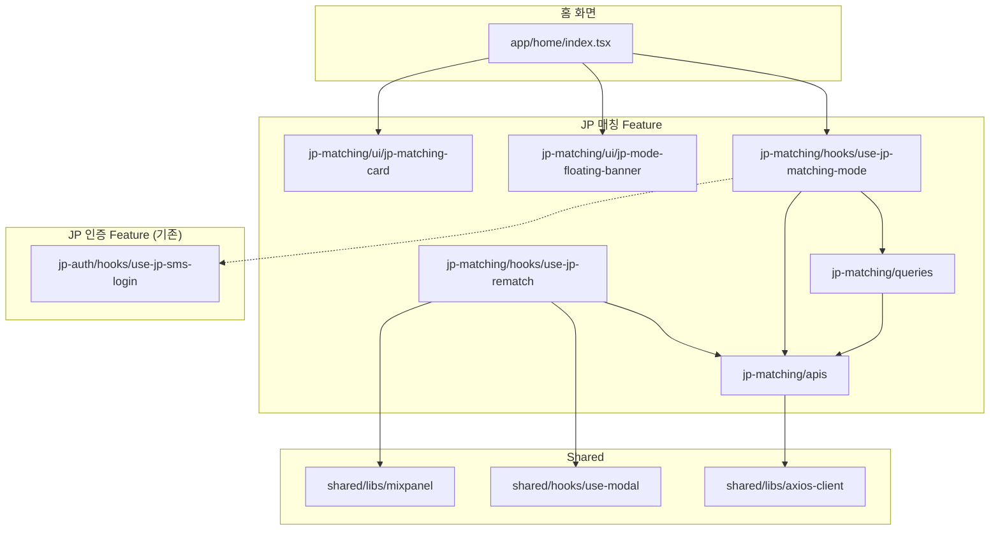

# 한일 매칭 FE 스펙 문서

> **작성일**: 2026-01-28
> **버전**: 1.0
> **상태**: Draft

---

## 1. 개요

### 1.1 목적
한국 유저와 일본 유저 간 크로스보더 매칭 기능 구현을 위한 프론트엔드 기술 스펙 문서

### 1.2 핵심 요구사항
| 항목 | 내용 |
|-----|-----|
| 온보딩 | JP SMS 인증만 필요 |
| 모드 전환 | 토글 방식 (국내 ↔ JP 자유 전환) |
| 매칭 풀 | 한국인 → 일본인 단방향 |
| 상태 저장 | 서버 (유저 프로필) |
| 데이터 관리 | 통합 관리 (태그로 구분) |
| 정기 매칭 | 미지원 (수동 재매칭만) |

---

## 2. 디렉토리 구조

```
src/features/
├── jp-matching/                    # 한일 매칭 메인 feature (신규)
│   ├── apis/
│   │   └── index.ts               # JP 매칭 API 호출
│   ├── hooks/
│   │   ├── use-jp-matching-mode.ts    # 매칭 모드 관리
│   │   ├── use-jp-rematch.ts          # JP 재매칭
│   │   └── index.ts
│   ├── queries/
│   │   ├── use-matching-mode.ts       # 매칭 모드 조회
│   │   ├── use-jp-matching-eligibility.ts  # JP 매칭 자격 조회
│   │   └── keys.ts
│   ├── stores/
│   │   └── jp-matching-store.ts   # Zustand 로컬 캐시
│   ├── ui/
│   │   ├── jp-mode-floating-banner.tsx  # 모드 표시 Floating UI
│   │   ├── jp-mode-toggle.tsx           # 모드 전환 토글
│   │   ├── jp-matching-card.tsx         # JP 매칭 카드
│   │   └── index.ts
│   ├── types.ts
│   └── index.ts
│
├── jp-auth/                        # 기존 JP 인증 (재사용)
│   ├── hooks/use-jp-sms-login.ts
│   ├── apis/index.ts
│   └── types/index.ts
│
└── matching-history/               # 기존 매칭 히스토리 (수정)
    ├── apis/index.tsx             # mode 파라미터 추가
    └── type.ts                    # MatchingMode 타입 추가
```

---

## 3. 타입 정의

### 3.1 매칭 모드 타입

```typescript
// src/features/jp-matching/types.ts

/**
 * 매칭 모드
 * - DOMESTIC: 국내 매칭 (기본값)
 * - JP: 한일 매칭
 */
export type MatchingMode = 'DOMESTIC' | 'JP';

/**
 * JP 매칭 자격 상태
 */
export interface JpMatchingEligibility {
  /** JP 매칭 가능 여부 */
  eligible: boolean;
  /** JP SMS 인증 완료 여부 */
  jpSmsVerified: boolean;
  /** 인증 완료 일시 */
  verifiedAt: string | null;
}

/**
 * 매칭 모드 상태 (서버 응답)
 */
export interface MatchingModeStatus {
  /** 현재 활성 모드 */
  currentMode: MatchingMode;
  /** JP 모드 사용 가능 여부 */
  jpModeAvailable: boolean;
  /** 마지막 모드 변경 일시 */
  lastChangedAt: string | null;
}

/**
 * 매칭 모드 전환 요청
 */
export interface SwitchMatchingModeRequest {
  mode: MatchingMode;
}

/**
 * 매칭 모드 전환 응답
 */
export interface SwitchMatchingModeResponse {
  success: boolean;
  currentMode: MatchingMode;
  message?: string;
}
```

### 3.2 JP 재매칭 타입

```typescript
// src/features/jp-matching/types.ts (계속)

/**
 * JP 재매칭 요청 파라미터
 */
export interface JpRematchParams {
  /** 매칭 컨텍스트 (optional) */
  context?: {
    previousMatchAttempts?: number;
  };
}

/**
 * JP 재매칭 성공 응답
 */
export interface JpRematchSuccessResponse {
  matchId: string;
  match: JpMatchData;
  canLetter: boolean;
}

/**
 * JP 매칭 데이터
 */
export interface JpMatchData {
  userId: string;
  nickname: string;
  age: number;
  profileImage: string;
  /** 국적 */
  nationality: 'KR' | 'JP';
  /** 지역 (일본 도시명) */
  region: string;
  /** 자기소개 */
  bio?: string;
  /** 관심사 */
  interests?: string[];
  /** 공통 관심사 */
  commonInterests?: string[];
}

/**
 * JP 재매칭 에러 응답
 */
export interface JpRematchErrorResponse {
  error: 'USER_NOT_FOUND' | 'NOT_ELIGIBLE' | 'RATE_LIMITED';
  message: string;
}

export type JpRematchResponse = JpRematchSuccessResponse | JpRematchErrorResponse;
```

### 3.3 매칭 히스토리 타입 확장

```typescript
// src/features/matching-history/type.ts (수정)

import { MatchingMode } from '@/src/features/jp-matching/types';

export type MatchingHistoryDetails = {
  matchId: string;
  blinded: boolean;
  imageUrl: string;
  deletedAt: string | null;
  age: number;
  mbti: string;
  universityName: string;
  universityAuthentication: boolean;
  someReceived: boolean;
  connectionId: string;
  lastLogin: string | null;
  /** 매칭 모드 (신규) */
  matchingMode: MatchingMode;
  /** 상대방 국적 (신규) */
  nationality?: 'KR' | 'JP';
};

/**
 * 매칭 히스토리 조회 파라미터
 */
export interface MatchingHistoryParams {
  /** 조회할 모드 (미지정 시 현재 활성 모드) */
  mode?: MatchingMode | 'ALL';
}
```

---

## 4. API 명세

### 4.1 매칭 모드 API

```typescript
// src/features/jp-matching/apis/index.ts

import { axiosClient } from '@/src/shared/libs/axios-client';
import {
  MatchingModeStatus,
  SwitchMatchingModeRequest,
  SwitchMatchingModeResponse,
  JpMatchingEligibility,
} from '../types';

/**
 * 현재 매칭 모드 조회
 */
export const getMatchingMode = (): Promise<MatchingModeStatus> => {
  return axiosClient.get('/v1/user/matching-mode');
};

/**
 * 매칭 모드 전환
 */
export const switchMatchingMode = (
  params: SwitchMatchingModeRequest
): Promise<SwitchMatchingModeResponse> => {
  return axiosClient.post('/v1/user/matching-mode', params);
};

/**
 * JP 매칭 자격 조회
 */
export const getJpMatchingEligibility = (): Promise<JpMatchingEligibility> => {
  return axiosClient.get('/v1/user/jp-matching/eligibility');
};
```

### 4.2 JP 재매칭 API

```typescript
// src/features/jp-matching/apis/index.ts (계속)

import { JpRematchParams, JpRematchResponse } from '../types';

/**
 * JP 재매칭 요청
 * - 한국인: 일본인 풀에서 매칭
 * - 일본인: 한국인 풀에서 매칭
 */
export const jpRematch = (
  params?: JpRematchParams
): Promise<JpRematchResponse> => {
  return axiosClient.post('/v3/matching/rematch/jp', params ?? {});
};
```

### 4.3 매칭 히스토리 API 수정

```typescript
// src/features/matching-history/apis/index.tsx (수정)

import { MatchingHistoryParams } from '../type';

/**
 * 매칭 히스토리 목록 조회
 * @param params.mode - 조회할 모드 (DOMESTIC | JP | ALL)
 */
export const getMatchingHistoryList = (
  params?: MatchingHistoryParams
): Promise<MatchingHistoryDetails[]> => {
  const queryParams = params?.mode ? `?mode=${params.mode}` : '';
  return axiosClient.get(`/v2/matching/history/list${queryParams}`);
};
```

---

## 5. Query/Mutation 훅

### 5.1 매칭 모드 쿼리

```typescript
// src/features/jp-matching/queries/use-matching-mode.ts

import { useQuery } from '@tanstack/react-query';
import { getMatchingMode } from '../apis';
import { jpMatchingKeys } from './keys';

export const useMatchingMode = () => {
  return useQuery({
    queryKey: jpMatchingKeys.mode(),
    queryFn: getMatchingMode,
    staleTime: 1000 * 60 * 5, // 5분
  });
};
```

### 5.2 JP 매칭 자격 쿼리

```typescript
// src/features/jp-matching/queries/use-jp-matching-eligibility.ts

import { useQuery } from '@tanstack/react-query';
import { getJpMatchingEligibility } from '../apis';
import { jpMatchingKeys } from './keys';

export const useJpMatchingEligibility = () => {
  return useQuery({
    queryKey: jpMatchingKeys.eligibility(),
    queryFn: getJpMatchingEligibility,
    staleTime: 1000 * 60 * 30, // 30분 (자주 변경되지 않음)
  });
};
```

### 5.3 쿼리 키 정의

```typescript
// src/features/jp-matching/queries/keys.ts

export const jpMatchingKeys = {
  all: ['jp-matching'] as const,
  mode: () => [...jpMatchingKeys.all, 'mode'] as const,
  eligibility: () => [...jpMatchingKeys.all, 'eligibility'] as const,
  history: (mode?: string) => [...jpMatchingKeys.all, 'history', mode] as const,
};
```

---

## 6. 커스텀 훅

### 6.1 매칭 모드 관리 훅

```typescript
// src/features/jp-matching/hooks/use-jp-matching-mode.ts

import { useMutation, useQueryClient } from '@tanstack/react-query';
import { useMatchingMode } from '../queries/use-matching-mode';
import { useJpMatchingEligibility } from '../queries/use-jp-matching-eligibility';
import { switchMatchingMode } from '../apis';
import { jpMatchingKeys } from '../queries/keys';
import { MatchingMode } from '../types';

export const useJpMatchingMode = () => {
  const queryClient = useQueryClient();

  const { data: modeStatus, isLoading: isModeLoading } = useMatchingMode();
  const { data: eligibility, isLoading: isEligibilityLoading } = useJpMatchingEligibility();

  const switchModeMutation = useMutation({
    mutationFn: switchMatchingMode,
    onSuccess: (data) => {
      // 모드 상태 캐시 업데이트
      queryClient.setQueryData(jpMatchingKeys.mode(), (old: any) => ({
        ...old,
        currentMode: data.currentMode,
        lastChangedAt: new Date().toISOString(),
      }));

      // 관련 쿼리 무효화
      queryClient.invalidateQueries({ queryKey: ['latest-matching-v2'] });
      queryClient.invalidateQueries({ queryKey: ['matching-history-list'] });
    },
  });

  const toggleMode = () => {
    if (!modeStatus) return;

    const newMode: MatchingMode =
      modeStatus.currentMode === 'DOMESTIC' ? 'JP' : 'DOMESTIC';

    switchModeMutation.mutate({ mode: newMode });
  };

  const switchToMode = (mode: MatchingMode) => {
    switchModeMutation.mutate({ mode });
  };

  return {
    // 상태
    currentMode: modeStatus?.currentMode ?? 'DOMESTIC',
    isJpMode: modeStatus?.currentMode === 'JP',
    jpModeAvailable: modeStatus?.jpModeAvailable ?? false,

    // 자격
    isEligible: eligibility?.eligible ?? false,
    isJpSmsVerified: eligibility?.jpSmsVerified ?? false,

    // 로딩
    isLoading: isModeLoading || isEligibilityLoading,
    isSwitching: switchModeMutation.isPending,

    // 액션
    toggleMode,
    switchToMode,

    // 에러
    error: switchModeMutation.error,
  };
};
```

### 6.2 JP 재매칭 훅

```typescript
// src/features/jp-matching/hooks/use-jp-rematch.ts

import { useMutation, useQueryClient } from '@tanstack/react-query';
import { jpRematch } from '../apis';
import { useModal } from '@/src/shared/hooks/use-modal';
import { JpRematchParams, JpRematchErrorResponse } from '../types';
import { trackJpMatchingQueueJoined, trackJpMatchingSuccess } from '@/src/shared/libs/mixpanel';

interface UseJpRematchOptions {
  onSuccess?: () => void;
  onError?: (error: JpRematchErrorResponse) => void;
}

export const useJpRematch = (options?: UseJpRematchOptions) => {
  const queryClient = useQueryClient();
  const { showModal } = useModal();

  const mutation = useMutation({
    mutationFn: (params?: JpRematchParams) => {
      trackJpMatchingQueueJoined();
      return jpRematch(params);
    },
    onSuccess: (data) => {
      if ('error' in data) {
        // 에러 응답 처리
        handleError(data);
        return;
      }

      // 성공 처리
      trackJpMatchingSuccess(data.matchId);

      // 관련 쿼리 갱신
      queryClient.invalidateQueries({ queryKey: ['latest-matching-v2'] });
      queryClient.invalidateQueries({ queryKey: ['matching-history-list'] });

      options?.onSuccess?.();
    },
    onError: (error: any) => {
      const errorResponse: JpRematchErrorResponse = {
        error: 'USER_NOT_FOUND',
        message: error.message ?? '매칭 상대를 찾을 수 없습니다.',
      };
      handleError(errorResponse);
    },
  });

  const handleError = (error: JpRematchErrorResponse) => {
    switch (error.error) {
      case 'USER_NOT_FOUND':
        showModal({
          title: '매칭 대기',
          children: (
            <JpMatchingEmptyState message={error.message} />
          ),
        });
        break;
      case 'NOT_ELIGIBLE':
        showModal({
          title: 'JP 인증 필요',
          children: (
            <JpAuthRequiredModal />
          ),
        });
        break;
      case 'RATE_LIMITED':
        showModal({
          title: '잠시 후 다시 시도해주세요',
          children: <RateLimitedModal />,
        });
        break;
    }
    options?.onError?.(error);
  };

  return {
    startJpRematch: mutation.mutate,
    isLoading: mutation.isPending,
    data: mutation.data,
    error: mutation.error,
    reset: mutation.reset,
  };
};
```

---

## 7. UI 컴포넌트

### 7.1 JP 모드 Floating 배너

```typescript
// src/features/jp-matching/ui/jp-mode-floating-banner.tsx

import { StyleSheet, View, Text, TouchableOpacity } from 'react-native';
import Animated, {
  useAnimatedStyle,
  withTiming,
  interpolate,
} from 'react-native-reanimated';
import { useSafeAreaInsets } from 'react-native-safe-area-context';
import { useJpMatchingMode } from '../hooks/use-jp-matching-mode';
import colors from '@/src/shared/constants/colors';

interface JpModeFloatingBannerProps {
  isVisible?: boolean;
  onPress?: () => void;
}

export function JpModeFloatingBanner({
  isVisible = true,
  onPress,
}: JpModeFloatingBannerProps) {
  const insets = useSafeAreaInsets();
  const { isJpMode, currentMode } = useJpMatchingMode();

  const animatedStyle = useAnimatedStyle(() => {
    const translateY = withTiming(isVisible ? 0 : -100, { duration: 300 });
    const opacity = withTiming(isVisible ? 1 : 0, { duration: 300 });

    return {
      transform: [{ translateY }],
      opacity,
    };
  });

  if (!isJpMode) return null;

  return (
    <Animated.View
      style={[
        styles.container,
        { top: insets.top + 8 },
        animatedStyle,
      ]}
    >
      <TouchableOpacity
        style={styles.banner}
        onPress={onPress}
        activeOpacity={0.8}
      >
        <Text style={styles.flag}>🇯🇵</Text>
        <Text style={styles.text}>일본 매칭 모드</Text>
        <Text style={styles.chevron}>›</Text>
      </TouchableOpacity>
    </Animated.View>
  );
}

const styles = StyleSheet.create({
  container: {
    position: 'absolute',
    left: 16,
    right: 16,
    zIndex: 100,
  },
  banner: {
    flexDirection: 'row',
    alignItems: 'center',
    justifyContent: 'center',
    backgroundColor: colors.brand.primary,
    paddingVertical: 10,
    paddingHorizontal: 16,
    borderRadius: 20,
    gap: 8,
  },
  flag: {
    fontSize: 16,
  },
  text: {
    color: colors.white,
    fontSize: 14,
    fontWeight: '600',
  },
  chevron: {
    color: colors.white,
    fontSize: 18,
    fontWeight: '300',
  },
});
```

### 7.2 JP 모드 토글

```typescript
// src/features/jp-matching/ui/jp-mode-toggle.tsx

import { StyleSheet, View, Text, Switch } from 'react-native';
import { useJpMatchingMode } from '../hooks/use-jp-matching-mode';
import colors from '@/src/shared/constants/colors';

interface JpModeToggleProps {
  onToggle?: (isJpMode: boolean) => void;
}

export function JpModeToggle({ onToggle }: JpModeToggleProps) {
  const {
    isJpMode,
    jpModeAvailable,
    isEligible,
    isSwitching,
    toggleMode,
  } = useJpMatchingMode();

  const handleToggle = () => {
    toggleMode();
    onToggle?.(!isJpMode);
  };

  const isDisabled = !jpModeAvailable || !isEligible || isSwitching;

  return (
    <View style={styles.container}>
      <View style={styles.labelContainer}>
        <Text style={styles.flag}>🇯🇵</Text>
        <Text style={styles.label}>일본 매칭</Text>
        {!isEligible && (
          <Text style={styles.badge}>인증 필요</Text>
        )}
      </View>
      <Switch
        value={isJpMode}
        onValueChange={handleToggle}
        disabled={isDisabled}
        trackColor={{
          false: colors.surface.disabled,
          true: colors.brand.primary,
        }}
        thumbColor={colors.white}
      />
    </View>
  );
}

const styles = StyleSheet.create({
  container: {
    flexDirection: 'row',
    alignItems: 'center',
    justifyContent: 'space-between',
    paddingVertical: 12,
    paddingHorizontal: 16,
    backgroundColor: colors.surface.background,
    borderRadius: 12,
  },
  labelContainer: {
    flexDirection: 'row',
    alignItems: 'center',
    gap: 8,
  },
  flag: {
    fontSize: 20,
  },
  label: {
    fontSize: 16,
    fontWeight: '500',
    color: colors.text.primary,
  },
  badge: {
    fontSize: 11,
    color: colors.text.tertiary,
    backgroundColor: colors.surface.secondary,
    paddingHorizontal: 6,
    paddingVertical: 2,
    borderRadius: 4,
    overflow: 'hidden',
  },
});
```

### 7.3 JP 매칭 카드

```typescript
// src/features/jp-matching/ui/jp-matching-card.tsx

import { StyleSheet, View, Text, ImageBackground, TouchableOpacity } from 'react-native';
import { LinearGradient } from 'expo-linear-gradient';
import { JpMatchData } from '../types';
import colors from '@/src/shared/constants/colors';

interface JpMatchingCardProps {
  match: JpMatchData;
  onPress?: () => void;
  endOfView?: Date;
}

export function JpMatchingCard({ match, onPress, endOfView }: JpMatchingCardProps) {
  const nationalityFlag = match.nationality === 'JP' ? '🇯🇵' : '🇰🇷';

  return (
    <TouchableOpacity
      style={styles.container}
      onPress={onPress}
      activeOpacity={0.95}
    >
      <ImageBackground
        source={{ uri: match.profileImage }}
        style={styles.background}
        imageStyle={styles.backgroundImage}
      >
        <LinearGradient
          colors={['transparent', 'rgba(0,0,0,0.7)']}
          style={styles.gradient}
        >
          {/* 국적 배지 */}
          <View style={styles.nationalityBadge}>
            <Text style={styles.flag}>{nationalityFlag}</Text>
            <Text style={styles.region}>{match.region}</Text>
          </View>

          {/* 프로필 정보 */}
          <View style={styles.infoContainer}>
            <Text style={styles.nickname}>
              {match.nickname}, {match.age}
            </Text>
            {match.bio && (
              <Text style={styles.bio} numberOfLines={2}>
                {match.bio}
              </Text>
            )}

            {/* 공통 관심사 */}
            {match.commonInterests && match.commonInterests.length > 0 && (
              <View style={styles.interestsContainer}>
                {match.commonInterests.slice(0, 3).map((interest, index) => (
                  <View key={index} style={styles.interestTag}>
                    <Text style={styles.interestText}>{interest}</Text>
                  </View>
                ))}
              </View>
            )}
          </View>
        </LinearGradient>
      </ImageBackground>
    </TouchableOpacity>
  );
}

const styles = StyleSheet.create({
  container: {
    width: '100%',
    aspectRatio: 3 / 4,
    borderRadius: 16,
    overflow: 'hidden',
  },
  background: {
    flex: 1,
  },
  backgroundImage: {
    resizeMode: 'cover',
  },
  gradient: {
    flex: 1,
    justifyContent: 'flex-end',
    padding: 16,
  },
  nationalityBadge: {
    position: 'absolute',
    top: 16,
    right: 16,
    flexDirection: 'row',
    alignItems: 'center',
    backgroundColor: 'rgba(0,0,0,0.5)',
    paddingHorizontal: 10,
    paddingVertical: 6,
    borderRadius: 16,
    gap: 4,
  },
  flag: {
    fontSize: 14,
  },
  region: {
    color: colors.white,
    fontSize: 12,
    fontWeight: '500',
  },
  infoContainer: {
    gap: 8,
  },
  nickname: {
    color: colors.white,
    fontSize: 24,
    fontWeight: '700',
  },
  bio: {
    color: 'rgba(255,255,255,0.8)',
    fontSize: 14,
    lineHeight: 20,
  },
  interestsContainer: {
    flexDirection: 'row',
    flexWrap: 'wrap',
    gap: 6,
    marginTop: 4,
  },
  interestTag: {
    backgroundColor: 'rgba(255,255,255,0.2)',
    paddingHorizontal: 10,
    paddingVertical: 4,
    borderRadius: 12,
  },
  interestText: {
    color: colors.white,
    fontSize: 12,
    fontWeight: '500',
  },
});
```

---

## 8. Zustand Store

```typescript
// src/features/jp-matching/stores/jp-matching-store.ts

import { create } from 'zustand';
import { MatchingMode, JpMatchData } from '../types';

interface JpMatchingState {
  // 로컬 캐시 (서버 상태의 클라이언트 캐시)
  cachedMode: MatchingMode | null;
  currentJpMatch: JpMatchData | null;

  // 액션
  setCachedMode: (mode: MatchingMode) => void;
  setCurrentJpMatch: (match: JpMatchData | null) => void;
  reset: () => void;
}

export const useJpMatchingStore = create<JpMatchingState>((set) => ({
  cachedMode: null,
  currentJpMatch: null,

  setCachedMode: (mode) => set({ cachedMode: mode }),
  setCurrentJpMatch: (match) => set({ currentJpMatch: match }),
  reset: () => set({ cachedMode: null, currentJpMatch: null }),
}));
```

---

## 9. 홈 화면 통합

### 9.1 홈 화면 수정 사항

```typescript
// app/home/index.tsx (수정 부분)

import { JpModeFloatingBanner } from '@/src/features/jp-matching/ui/jp-mode-floating-banner';
import { useJpMatchingMode } from '@/src/features/jp-matching/hooks/use-jp-matching-mode';

export default function HomeScreen() {
  const { isJpMode } = useJpMatchingMode();
  const [isCardVisible, setIsCardVisible] = useState(true);

  // ... 기존 코드 ...

  return (
    <View style={styles.container}>
      {/* JP 모드 Floating 배너 (신규) */}
      <JpModeFloatingBanner
        isVisible={isCardVisible && isJpMode}
        onPress={() => router.push('/settings/matching-mode')}
      />

      {/* 기존 Header */}
      <Header.Container>
        {/* ... */}
      </Header.Container>

      <ScrollView onScroll={handleScroll}>
        {/* ... 기존 컨텐츠 ... */}

        {/* 매칭 카드 (조건부 렌더링) */}
        {isJpMode ? (
          <JpIdleMatchTimer />  // JP 매칭용 타이머/카드
        ) : (
          <IdleMatchTimer />    // 기존 국내 매칭
        )}

        {/* ... 기존 컨텐츠 ... */}
      </ScrollView>

      {/* 기존 FloatingSummaryCard */}
      {shouldShowFloatingCard && (
        <FloatingSummaryCard {...props} />
      )}
    </View>
  );
}
```

---

## 10. Mixpanel 이벤트

### 10.1 이벤트 정의

```typescript
// src/shared/libs/mixpanel/jp-matching-events.ts

import { track } from './core';

/**
 * JP 매칭 모드 전환
 */
export const trackJpModeSwitch = (
  fromMode: MatchingMode,
  toMode: MatchingMode
) => {
  track('JP_Mode_Switch', {
    from_mode: fromMode,
    to_mode: toMode,
    timestamp: new Date().toISOString(),
  });
};

/**
 * JP 매칭 대기열 진입
 */
export const trackJpMatchingQueueJoined = () => {
  track('JP_Matching_Queue_Joined', {
    timestamp: new Date().toISOString(),
  });
};

/**
 * JP 매칭 성공
 */
export const trackJpMatchingSuccess = (matchId: string) => {
  track('JP_Matching_Success', {
    match_id: matchId,
    timestamp: new Date().toISOString(),
  });
};

/**
 * JP 매칭 실패 (매칭 상대 없음)
 */
export const trackJpMatchingEmpty = () => {
  track('JP_Matching_Empty', {
    timestamp: new Date().toISOString(),
  });
};

/**
 * JP 온보딩 시작
 */
export const trackJpOnboardingStart = () => {
  track('JP_Onboarding_Start', {
    timestamp: new Date().toISOString(),
  });
};

/**
 * JP 온보딩 완료
 */
export const trackJpOnboardingComplete = () => {
  track('JP_Onboarding_Complete', {
    timestamp: new Date().toISOString(),
  });
};
```

---

## 11. i18n 키

```typescript
// src/shared/libs/i18n/locales/ko.json (추가)

{
  "features": {
    "jpMatching": {
      "mode": {
        "title": "일본 매칭",
        "domestic": "국내 매칭",
        "jp": "일본 매칭",
        "switchTo": "{{mode}} 모드로 전환",
        "currentMode": "현재 {{mode}} 모드"
      },
      "banner": {
        "jpMode": "일본 매칭 모드",
        "tapToSwitch": "탭하여 모드 변경"
      },
      "rematch": {
        "title": "재매칭",
        "searching": "일본 매칭 상대를 찾고 있습니다...",
        "empty": "현재 매칭 가능한 상대가 없습니다",
        "emptyTip": "잠시 후 다시 시도해주세요"
      },
      "eligibility": {
        "required": "JP 인증 필요",
        "verified": "인증 완료",
        "verifyNow": "지금 인증하기"
      },
      "card": {
        "nationality": {
          "KR": "한국",
          "JP": "일본"
        }
      }
    }
  }
}
```

---

## 12. 의존성 관계



---

## 13. 테스트 케이스

### 13.1 단위 테스트

```typescript
// __tests__/features/jp-matching/use-jp-matching-mode.test.ts

describe('useJpMatchingMode', () => {
  it('초기 상태는 DOMESTIC 모드', () => {
    const { result } = renderHook(() => useJpMatchingMode());
    expect(result.current.currentMode).toBe('DOMESTIC');
    expect(result.current.isJpMode).toBe(false);
  });

  it('JP 인증 미완료 시 jpModeAvailable이 false', () => {
    // mock eligibility API to return { eligible: false }
    const { result } = renderHook(() => useJpMatchingMode());
    expect(result.current.jpModeAvailable).toBe(false);
  });

  it('toggleMode 호출 시 모드 전환', async () => {
    const { result } = renderHook(() => useJpMatchingMode());

    act(() => {
      result.current.toggleMode();
    });

    await waitFor(() => {
      expect(result.current.currentMode).toBe('JP');
    });
  });
});
```

---

## 14. 체크리스트

### 14.1 구현 체크리스트

- [ ] `src/features/jp-matching/` 디렉토리 생성
- [ ] 타입 정의 (`types.ts`)
- [ ] API 함수 (`apis/index.ts`)
- [ ] 쿼리 훅 (`queries/`)
- [ ] 커스텀 훅 (`hooks/`)
- [ ] UI 컴포넌트 (`ui/`)
- [ ] Zustand Store (`stores/`)
- [ ] 홈 화면 통합
- [ ] Mixpanel 이벤트 추가
- [ ] i18n 키 추가
- [ ] 매칭 히스토리 API 수정

### 14.2 검증 체크리스트

- [ ] JP 인증 미완료 시 토글 비활성화
- [ ] 모드 전환 시 매칭 카드 변경
- [ ] JP 모드에서 Floating 배너 표시
- [ ] 재매칭 성공/실패 처리
- [ ] 모드별 매칭 히스토리 조회
- [ ] Mixpanel 이벤트 정상 전송

---

## 변경 이력

| 버전 | 날짜 | 작성자 | 내용 |
|-----|-----|-------|-----|
| 1.0 | 2026-01-28 | - | 초안 작성 |
