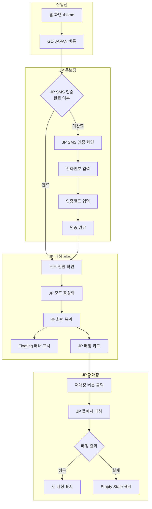
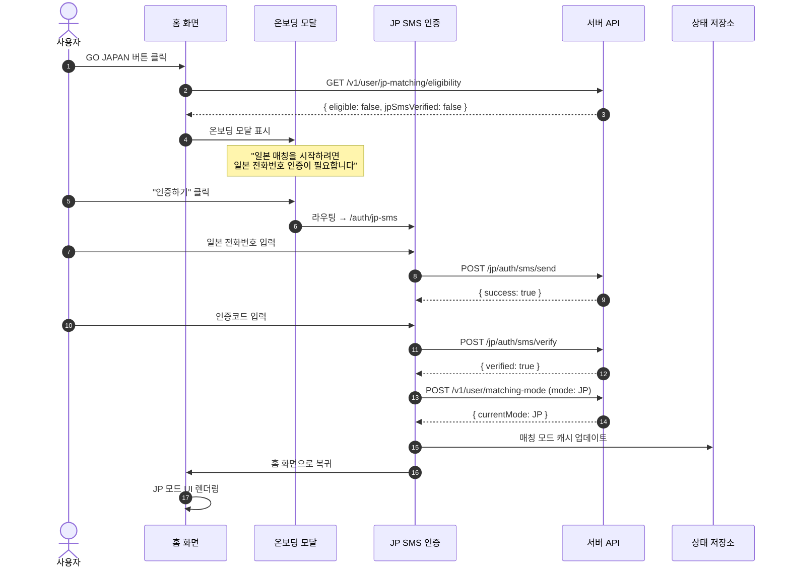
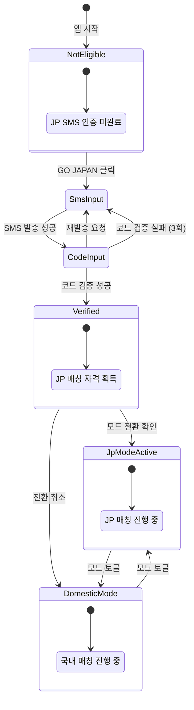
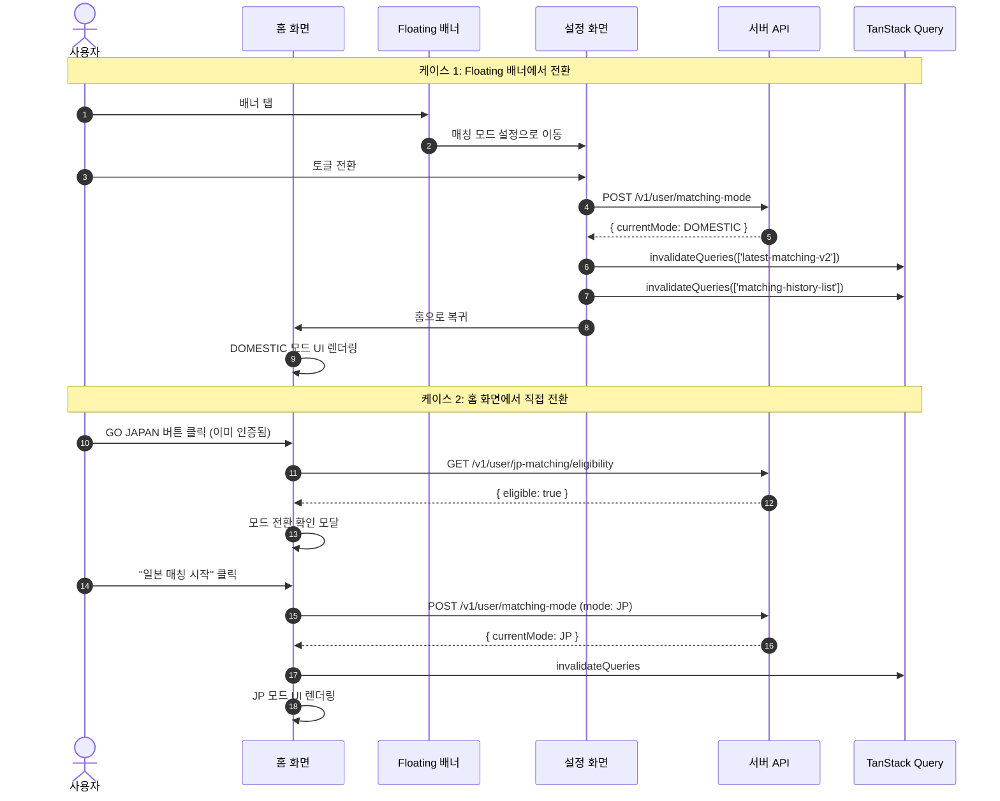
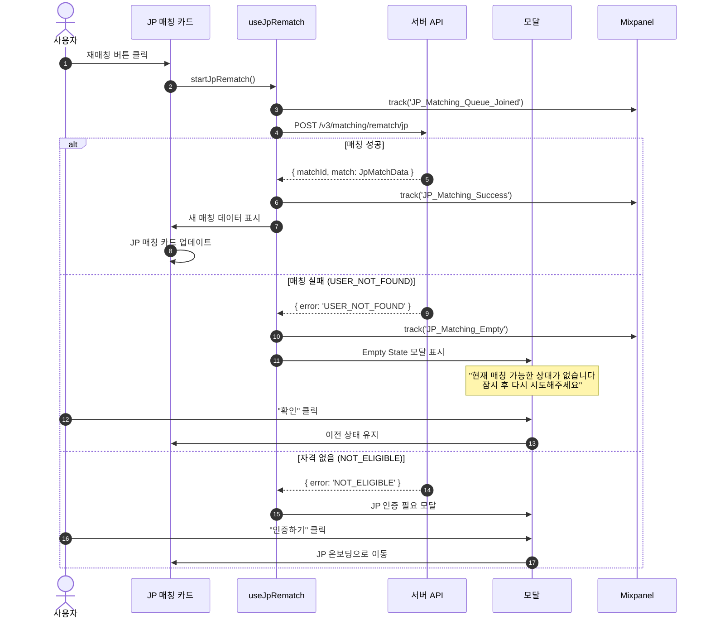
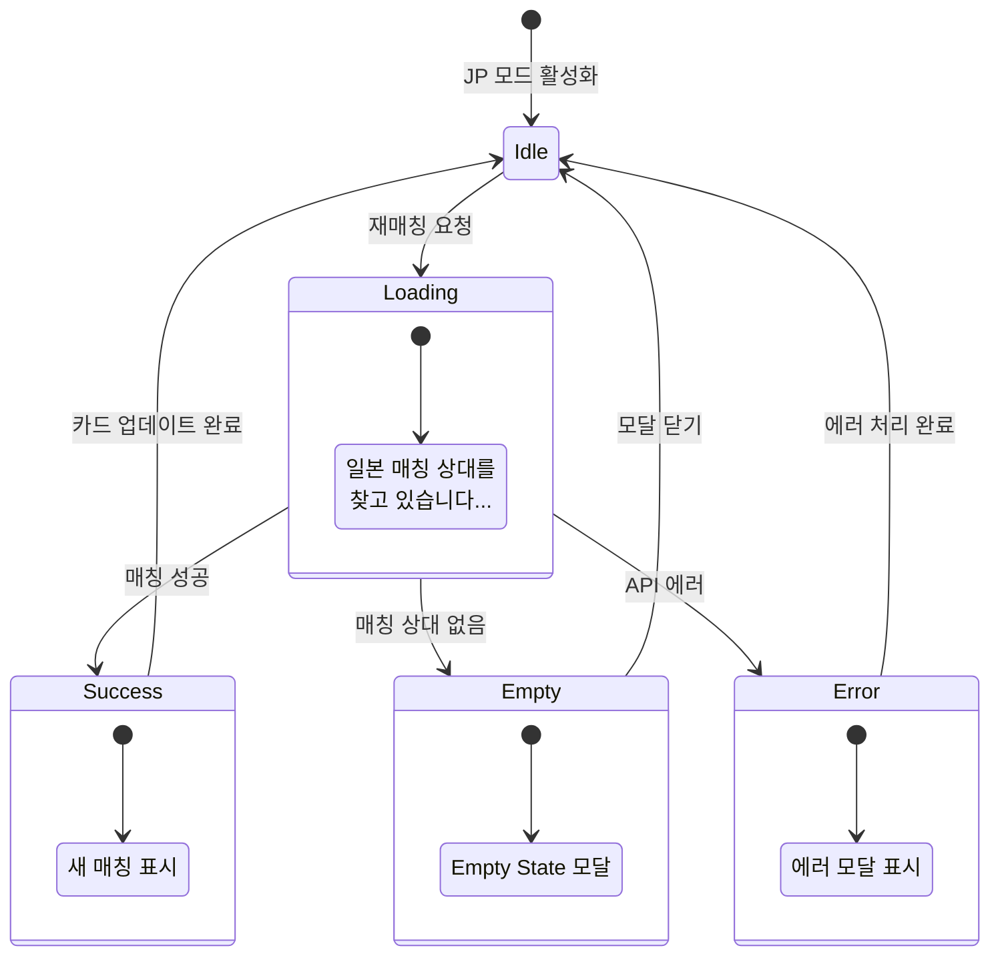
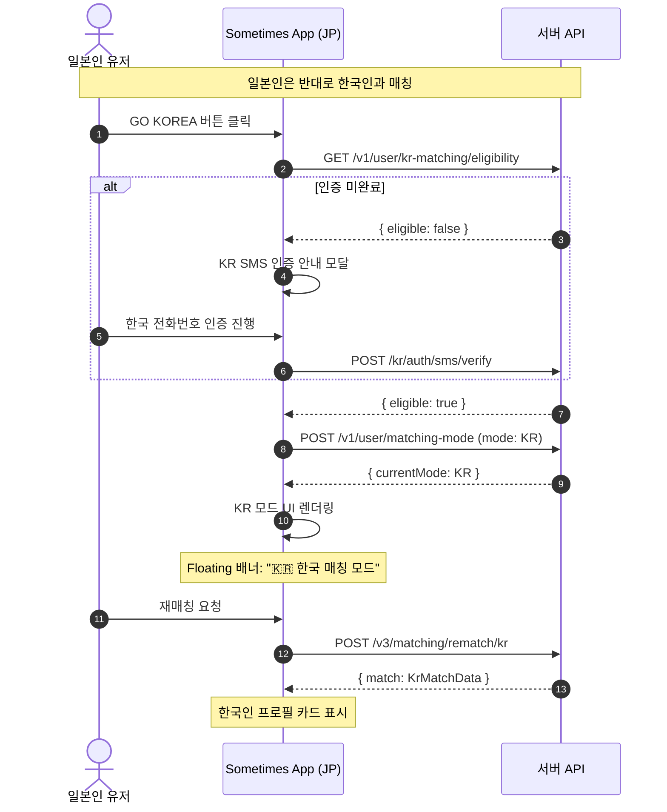
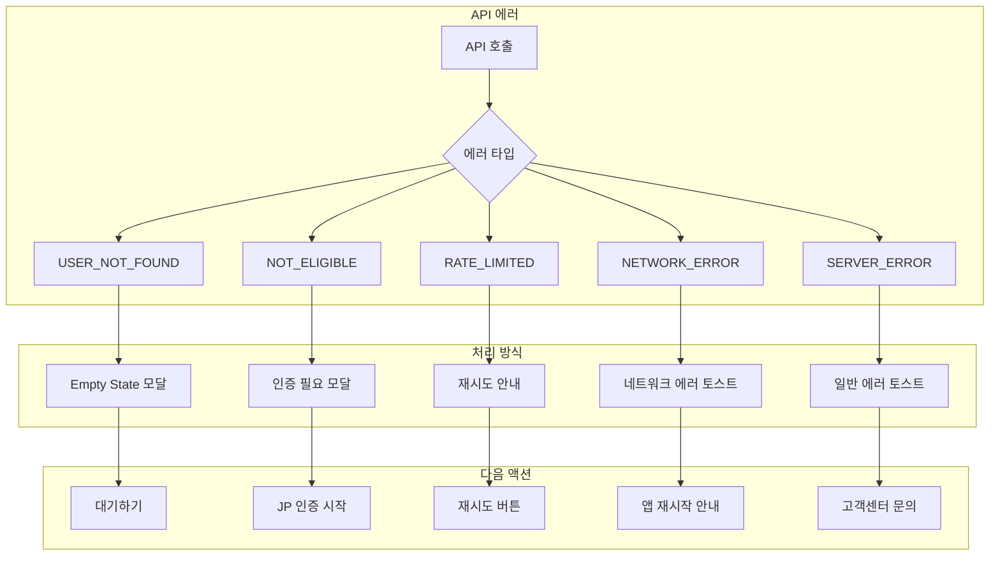
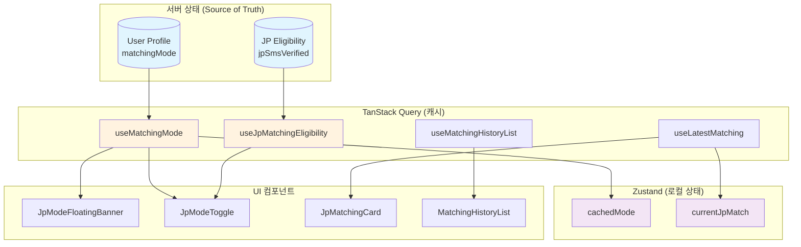
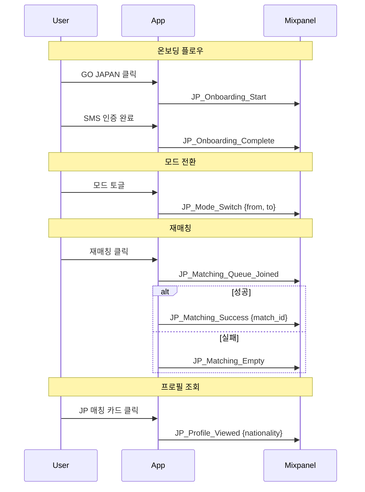

# 한일 매칭 플로우 문서

> **작성일**: 2026-01-28
> **버전**: 1.0
> **상태**: Draft

---

## 1. 전체 플로우 개요



---

## 2. 상세 플로우

### 2.1 JP 온보딩 플로우

#### 2.1.1 시퀀스 다이어그램



#### 2.1.2 화면 전환 플로우

```
[홈 화면]
    │
    ▼ GO JAPAN 버튼 클릭
    │
[JP 자격 확인]
    │
    ├─ 인증 완료 ──────────────────────────────────┐
    │                                               │
    ▼ 인증 미완료                                    │
    │                                               │
[온보딩 안내 모달]                                   │
    │                                               │
    ├─ "나중에" ── [모달 닫기] ── [홈 화면]           │
    │                                               │
    ▼ "인증하기"                                     │
    │                                               │
[JP SMS 인증 화면]                                   │
    │ /auth/jp-sms                                  │
    │                                               │
    ├─ Step 1: 전화번호 입력                         │
    │   └─ +81 일본 국가코드                         │
    │                                               │
    ├─ Step 2: 인증코드 입력                         │
    │   └─ 180초 타이머                             │
    │                                               │
    ▼ 인증 성공                                      │
    │                                               │
[모드 전환 확인 모달] ◄────────────────────────────┘
    │
    ├─ "국내 매칭 유지" ── [홈 화면 (DOMESTIC)]
    │
    ▼ "일본 매칭 시작"
    │
[홈 화면 (JP 모드)]
    ├─ Floating 배너: "🇯🇵 일본 매칭 모드"
    └─ JP 매칭 카드 표시
```

#### 2.1.3 상태 다이어그램



---

### 2.2 모드 전환 플로우

#### 2.2.1 시퀀스 다이어그램



#### 2.2.2 모드별 UI 상태

```
┌─────────────────────────────────────────────────────────────┐
│                    DOMESTIC 모드 (기본)                      │
├─────────────────────────────────────────────────────────────┤
│  ┌─────────────────────────────────────────────────────┐   │
│  │ Header: [로고] [알림] [젬스토어]                       │   │
│  └─────────────────────────────────────────────────────┘   │
│                                                             │
│  ┌─────────────────────────────────────────────────────┐   │
│  │                                                       │   │
│  │              [ 국내 매칭 카드 ]                        │   │
│  │                                                       │   │
│  │  서울, 25세                                            │   │
│  │  ENFP · 서울대학교                                     │   │
│  │                                                       │   │
│  └─────────────────────────────────────────────────────┘   │
│                                                             │
│  ┌─────────────────────────────────────────────────────┐   │
│  │ [GO JAPAN 배너] 일본 친구를 만나보세요!                 │   │
│  └─────────────────────────────────────────────────────┘   │
│                                                             │
│                     [ FloatingSummaryCard ]                 │
│                     "3명이 회원님을 봤어요"                  │
└─────────────────────────────────────────────────────────────┘

                            ▼ 모드 전환

┌─────────────────────────────────────────────────────────────┐
│                       JP 모드 (활성화)                       │
├─────────────────────────────────────────────────────────────┤
│  ┌─────────────────────────────────────────────────────┐   │
│  │         🇯🇵 일본 매칭 모드  ›                         │   │
│  │         (Floating Banner - 탭하면 설정 이동)          │   │
│  └─────────────────────────────────────────────────────┘   │
│                                                             │
│  ┌─────────────────────────────────────────────────────┐   │
│  │ Header: [로고] [알림] [젬스토어]                       │   │
│  └─────────────────────────────────────────────────────┘   │
│                                                             │
│  ┌─────────────────────────────────────────────────────┐   │
│  │                    🇯🇵 Tokyo                          │   │
│  │              [ JP 매칭 카드 ]                          │   │
│  │                                                       │   │
│  │  Yuki, 24세                                           │   │
│  │  도쿄 · 공통관심사: K-POP, 여행                        │   │
│  │                                                       │   │
│  └─────────────────────────────────────────────────────┘   │
│                                                             │
│  ┌─────────────────────────────────────────────────────┐   │
│  │ [국내 매칭으로 돌아가기] (숨김 or 축소)                  │   │
│  └─────────────────────────────────────────────────────┘   │
│                                                             │
│                     [ FloatingSummaryCard ]                 │
│                     "2명이 회원님을 봤어요"                  │
└─────────────────────────────────────────────────────────────┘
```

---

### 2.3 JP 재매칭 플로우

#### 2.3.1 시퀀스 다이어그램



#### 2.3.2 재매칭 상태 플로우



#### 2.3.3 재매칭 UI 상태

```
[재매칭 버튼 클릭]
        │
        ▼
┌───────────────────────┐
│     로딩 상태          │
│                       │
│   ◉ ◉ ◉ (스피너)       │
│                       │
│  "일본 매칭 상대를      │
│   찾고 있습니다..."     │
│                       │
└───────────────────────┘
        │
        ├── 성공 ──────────────────────────┐
        │                                   │
        ▼ 실패                              ▼
┌───────────────────────┐    ┌───────────────────────┐
│     Empty State       │    │     새 매칭 카드       │
│                       │    │                       │
│   😢                   │    │  🇯🇵 Osaka             │
│                       │    │                       │
│  "현재 매칭 가능한      │    │  Sakura, 23세         │
│   상대가 없습니다"      │    │  오사카               │
│                       │    │  공통: 애니메이션      │
│   💡 Tip               │    │                       │
│   잠시 후 다시         │    │  [더보기]             │
│   시도해주세요         │    │                       │
│                       │    └───────────────────────┘
│   [대기하기]           │
│                       │
└───────────────────────┘
```

---

### 2.4 일본인 유저 플로우

#### 2.4.1 일본인 관점 플로우



#### 2.4.2 양방향 매칭 구조

```
┌─────────────────────────────────────────────────────────────┐
│                       매칭 풀 구조                           │
├─────────────────────────────────────────────────────────────┤
│                                                             │
│   ┌─────────────┐                    ┌─────────────┐       │
│   │   한국인     │                    │   일본인     │       │
│   │   유저 풀    │                    │   유저 풀    │       │
│   │             │                    │             │       │
│   │  JP 모드    │ ─────매칭─────▶   │  (대상)     │       │
│   │  활성화     │                    │             │       │
│   │             │                    │             │       │
│   └─────────────┘                    └─────────────┘       │
│         ▲                                   │               │
│         │                                   │               │
│         └──────────매칭──────────────────────┘               │
│                                   KR 모드 활성화            │
│                                                             │
├─────────────────────────────────────────────────────────────┤
│   정리:                                                     │
│   • 한국인(JP모드) → 일본인에게 매칭됨                        │
│   • 일본인(KR모드) → 한국인에게 매칭됨                        │
│   • 단방향 매칭: 본인이 선택한 모드의 상대국 유저만 표시       │
└─────────────────────────────────────────────────────────────┘
```

---

## 3. 에러 처리 플로우

### 3.1 에러 시나리오별 처리



### 3.2 에러 메시지 정의

| 에러 코드 | 제목 | 메시지 | CTA |
|----------|-----|-------|-----|
| `USER_NOT_FOUND` | 매칭 대기 | 현재 매칭 가능한 상대가 없습니다 | 대기하기 |
| `NOT_ELIGIBLE` | JP 인증 필요 | 일본 매칭을 위해 인증이 필요합니다 | 인증하기 |
| `RATE_LIMITED` | 잠시 후 시도 | 요청이 너무 많습니다. 잠시 후 다시 시도해주세요 | 확인 |
| `NETWORK_ERROR` | 연결 오류 | 네트워크 연결을 확인해주세요 | 재시도 |
| `SERVER_ERROR` | 오류 발생 | 일시적인 오류가 발생했습니다 | 다시 시도 |

---

## 4. 라우팅 구조

### 4.1 관련 라우트

```
app/
├── home/
│   └── index.tsx              # 홈 화면 (JP 모드 통합)
├── auth/
│   └── jp-sms/
│       └── index.tsx          # JP SMS 인증 (기존)
├── settings/
│   └── matching-mode/
│       └── index.tsx          # 매칭 모드 설정 (신규)
└── profile/
    └── [userId]/
        └── index.tsx          # 프로필 상세 (국적 표시 추가)
```

### 4.2 네비게이션 플로우

```mermaid
graph LR
    A[/home] --> B[GO JAPAN 클릭]
    B --> C{인증 여부}
    C -->|미인증| D[/auth/jp-sms]
    C -->|인증됨| E[모드 전환 모달]
    D --> F[인증 완료]
    F --> E
    E --> G[/home JP모드]

    G --> H[배너 클릭]
    H --> I[/settings/matching-mode]
    I --> J[토글 전환]
    J --> K[/home DOMESTIC모드]

    G --> L[매칭 카드 클릭]
    L --> M[/profile/userId]
```

---

## 5. 데이터 플로우

### 5.1 상태 관리 구조



### 5.2 쿼리 무효화 전략

```typescript
// 모드 전환 시 무효화할 쿼리
const invalidateOnModeSwitch = [
  'latest-matching-v2',      // 현재 매칭 정보
  'matching-history-list',   // 매칭 히스토리
  'home-summary',            // 홈 요약 (나를 본 사람)
];

// JP 재매칭 성공 시 무효화할 쿼리
const invalidateOnJpRematch = [
  'latest-matching-v2',
  'gem:current',             // 구슬 잔액 (재매칭권 사용 시)
];
```

---

## 6. Mixpanel 이벤트 플로우

### 6.1 이벤트 트래킹 포인트



### 6.2 이벤트 목록

| 이벤트명 | 트리거 | 속성 |
|---------|-------|-----|
| `JP_Onboarding_Start` | GO JAPAN 버튼 클릭 (미인증) | - |
| `JP_Onboarding_Complete` | JP SMS 인증 완료 | - |
| `JP_Mode_Switch` | 모드 전환 | `from_mode`, `to_mode` |
| `JP_Matching_Queue_Joined` | 재매칭 요청 | - |
| `JP_Matching_Success` | 매칭 성공 | `match_id` |
| `JP_Matching_Empty` | 매칭 상대 없음 | - |
| `JP_Profile_Viewed` | 프로필 카드 클릭 | `nationality`, `match_id` |

---

## 7. 구현 우선순위

### Phase 1: 기본 플로우 (MVP)
1. ✅ JP SMS 인증 (기존 재사용)
2. 🔲 매칭 모드 API 연동
3. 🔲 JP 모드 Floating 배너
4. 🔲 모드 전환 토글

### Phase 2: 매칭 기능
5. 🔲 JP 재매칭 API 연동
6. 🔲 JP 매칭 카드 컴포넌트
7. 🔲 Empty State 처리

### Phase 3: 히스토리 & 분석
8. 🔲 매칭 히스토리 모드 필터
9. 🔲 Mixpanel 이벤트
10. 🔲 일본인 유저 플로우 (대칭 구현)

---

## 변경 이력

| 버전 | 날짜 | 작성자 | 내용 |
|-----|-----|-------|-----|
| 1.0 | 2026-01-28 | - | 초안 작성 |
