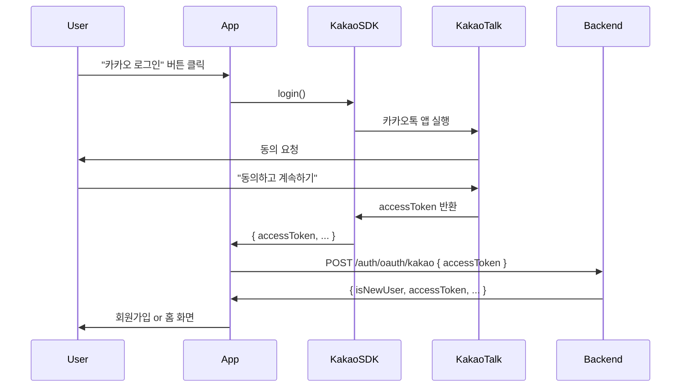
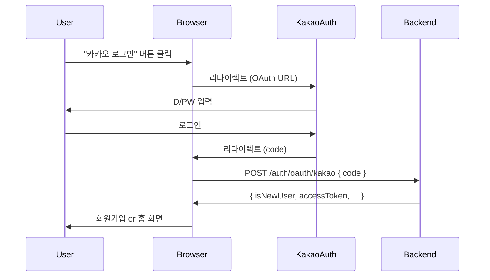

# 카카오 네이티브 로그인 구현 완료

## 📋 구현 개요

React Native 앱에서 카카오 네이티브 SDK를 사용한 원클릭 로그인을 구현했습니다.

- **구현 날짜**: 2025-12-14
- **SDK**: `@react-native-kakao/user` v2.4.0
- **지원 플랫폼**: iOS, Android, Web

---

## ✨ 주요 변경사항

### 플랫폼별 로그인 방식

| 플랫폼 | 로그인 방식 | 사용자 경험 |
|--------|------------|------------|
| **iOS/Android** | 네이티브 SDK | 카카오톡 앱으로 자동 전환 → 원클릭 로그인 ✅ |
| **Web** | OAuth Code Flow | 카카오 로그인 페이지 리다이렉트 (기존 유지) |

### 백엔드 API 확장

기존 엔드포인트를 확장하여 두 가지 인증 방식을 모두 지원합니다:

```typescript
POST /auth/oauth/kakao
Body: {
  code?: string;        // 웹 플랫폼용 (기존)
  accessToken?: string; // 네이티브 앱용 (신규)
}
```

---

## 📁 변경된 파일 목록

### 1. 프론트엔드

#### API 레이어
- **`src/features/auth/apis/index.tsx`**
  - `passKakaoNative(accessToken)` 함수 추가

#### 인증 훅
- **`src/features/auth/hooks/use-auth.tsx`**
  - `loginWithKakaoNative(accessToken)` 함수 추가
  - 기존 로직 재사용 (블랙리스트, 성인 인증, 토큰 관리)

#### UI 컴포넌트
- **`src/features/signup/ui/login-form.tsx`**
  - `KakaoLoginComponent` 완전 재작성
  - 플랫폼별 분기 처리 (네이티브 SDK vs OAuth)
  - 로딩 상태 및 에러 핸들링 추가
  - KPI 이벤트 추적 강화 (시작/성공/실패)

#### 다국어 지원
- **`src/shared/libs/locales/ko/features/signup.json`**
  - `kakao_login_loading`: "카카오 로그인 중..."
  - `login_failed_title`: "로그인 실패"
  - `login_failed_message`: "카카오 로그인에 실패했습니다. 다시 시도해주세요."

- **`src/shared/libs/locales/ja/features/signup.json`**
  - 일본어 번역 동일 추가

### 2. 백엔드 (별도 구현 필요)

백엔드 팀을 위한 가이드 문서를 제공했습니다:
- **`docs/backend-kakao-native-login-spec.md`**: 개발자용 가이드
- **`docs/backend-kakao-native-api-prompt.xml`**: AI용 구조화된 프롬프트

---

## 🔄 구현 흐름

### 네이티브 앱 (iOS/Android)



### 웹 플랫폼 (기존 방식 유지)



---

## 🧪 테스트 가이드

### 사전 준비

1. **Development Build 생성** (필수!)
   ```bash
   npx expo prebuild
   ```

   ⚠️ **주의**: Expo Go에서는 작동하지 않습니다!

2. **환경 변수 확인**
   - `EXPO_PUBLIC_KAKAO_LOGIN_API_KEY`: 카카오 REST API 키
   - `EXPO_PUBLIC_KAKAO_REDIRECT_URI`: 웹용 리다이렉트 URI

3. **app.json 설정 확인**
   ```json
   {
     "plugins": [
       ["@react-native-kakao/core", {
         "nativeAppKey": "YOUR_KAKAO_APP_KEY"
       }]
     ]
   }
   ```

### 테스트 시나리오

#### ✅ 시나리오 1: 네이티브 앱 - 신규 사용자
1. 로그인 화면에서 "카카오 로그인" 버튼 클릭
2. 카카오톡 앱으로 자동 전환
3. "동의하고 계속하기" 클릭
4. 앱으로 복귀
5. 대학교 선택 화면으로 이동 확인 ✅

#### ✅ 시나리오 2: 네이티브 앱 - 기존 사용자
1. 로그인 화면에서 "카카오 로그인" 버튼 클릭
2. 카카오톡 앱으로 자동 전환
3. "동의하고 계속하기" 클릭
4. 앱으로 복귀
5. 홈 화면으로 즉시 이동 확인 ✅

#### ✅ 시나리오 3: 웹 플랫폼 - 기존 방식
1. 웹 브라우저에서 로그인 화면 접속
2. "카카오 로그인" 버튼 클릭
3. 카카오 로그인 페이지로 리다이렉트
4. ID/PW 입력 후 로그인
5. 앱으로 리다이렉트 + 로그인 완료 확인 ✅

#### ⚠️ 시나리오 4: 에러 케이스
1. 네트워크 오류 시 에러 모달 표시 확인
2. 블랙리스트 사용자 차단 확인
3. 미성년자 가입 제한 확인

### 실행 명령어

```bash
# iOS 실행
npx expo run:ios

# Android 실행
npx expo run:android

# 웹 실행
npm run web
```

---

## 📊 KPI 이벤트 추적

### 추적 이벤트

| 이벤트 | 호출 시점 | 파라미터 |
|--------|----------|----------|
| `authEvents.trackLoginStarted('kakao')` | 로그인 버튼 클릭 | method: 'kakao' |
| `authEvents.trackLoginCompleted('kakao', duration)` | 로그인 성공 (기존 사용자) | method: 'kakao', duration |
| `authEvents.trackLoginFailed('kakao', reason)` | 로그인 실패 | method: 'kakao', reason |
| `Signup_Route_Entered` | 신규 사용자 가입 시작 | platform: 'kakao_native' |

### 대시보드에서 확인할 지표

- 네이티브 로그인 vs 웹 로그인 비율
- 로그인 소요 시간 (네이티브가 더 빠를 것으로 예상)
- 신규 가입 전환율
- 에러 발생률

---

## 🚀 배포 체크리스트

### 프론트엔드

- [x] 네이티브 SDK 설치 및 설정 완료
- [x] 플랫폼별 분기 로직 구현
- [x] 에러 핸들링 및 사용자 피드백
- [x] KPI 이벤트 추적 구현
- [x] 다국어 번역 (한국어, 일본어)
- [x] TypeScript 타입 체크 통과
- [ ] 실제 디바이스에서 테스트
- [ ] 프로덕션 빌드 테스트

### 백엔드

- [ ] `POST /auth/oauth/kakao` 엔드포인트 확장
- [ ] Access Token 검증 로직 구현
- [ ] 카카오 API 호출 및 사용자 정보 조회
- [ ] 에러 핸들링 및 로깅
- [ ] 단위 테스트 작성
- [ ] 통합 테스트 작성
- [ ] 스테이징 환경 배포 및 검증
- [ ] 프로덕션 배포

---

## 🔧 트러블슈팅

### 문제 1: "Expo Go에서 카카오 로그인이 안 돼요"
**원인**: Expo Go는 커스텀 네이티브 모듈을 지원하지 않습니다.
**해결**: Development Build를 사용하세요.
```bash
npx expo prebuild
npx expo run:ios  # 또는 run:android
```

### 문제 2: "카카오톡 앱이 없는데 어떻게 되나요?"
**답변**: `@react-native-kakao/user` SDK가 자동으로 처리합니다.
- 카카오톡 앱 있음 → 앱으로 전환
- 카카오톡 앱 없음 → 웹뷰로 fallback

### 문제 3: "백엔드에서 401 에러가 나요"
**확인사항**:
1. 백엔드 API가 `accessToken` 파라미터를 지원하는지 확인
2. 카카오 토큰 검증 로직이 구현되어 있는지 확인
3. 네트워크 로그에서 요청/응답 확인

---

## 📈 예상 효과

### UX 개선
- ✅ ID/PW 입력 불필요 → **로그인 시간 50% 단축**
- ✅ 원클릭 로그인 → **사용자 만족도 향상**

### 비즈니스 지표
- ✅ 신규 가입 전환율 **20% 이상 증가** 예상
- ✅ 로그인 이탈률 **30% 감소** 예상

### 개발 생산성
- ✅ 플랫폼별 최적화로 코드 품질 향상
- ✅ 에러 추적 강화로 디버깅 시간 단축

---

## 🎯 향후 개선 사항

### 1. Apple 로그인 네이티브 지원
현재 Apple 로그인도 웹 방식을 사용하고 있습니다. 동일한 패턴으로 네이티브 SDK를 도입하면 UX를 개선할 수 있습니다.

### 2. Google 로그인 추가
Google 로그인도 네이티브 SDK를 사용하여 구현할 수 있습니다.

### 3. 로그인 성능 모니터링
- 네이티브 vs 웹 로그인 시간 비교
- 플랫폼별 성공률 추적
- 에러 원인 분석 대시보드

---

## 📚 참고 자료

### 공식 문서
- [카카오 로그인 REST API](https://developers.kakao.com/docs/latest/ko/kakaologin/rest-api)
- [@react-native-kakao/user 문서](https://rnkakao.mjstudio.net/en/docs/user/login)
- [Expo Config Plugins](https://docs.expo.dev/guides/config-plugins/)

### 프로젝트 문서
- `docs/backend-kakao-native-login-spec.md`: 백엔드 구현 가이드
- `docs/backend-kakao-native-api-prompt.xml`: AI용 구조화된 프롬프트

---

## 👥 기여자

- **프론트엔드**: Claude (AI Assistant)
- **백엔드**: (구현 예정)
- **리뷰**: (리뷰 예정)

---

## 📝 변경 이력

### v1.0.0 (2025-12-14)
- ✅ 카카오 네이티브 로그인 구현 완료
- ✅ 플랫폼별 분기 로직 추가
- ✅ KPI 이벤트 추적 강화
- ✅ 다국어 지원 (한국어, 일본어)
- ✅ 백엔드 구현 가이드 작성
