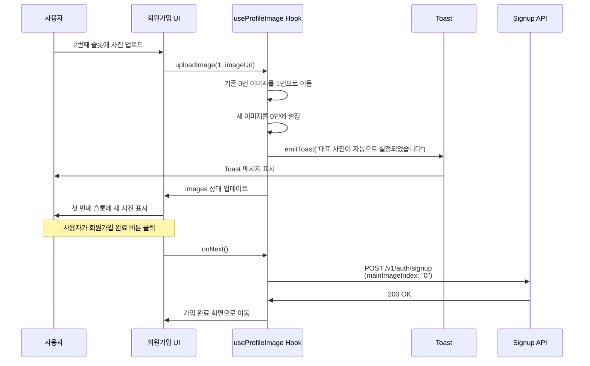
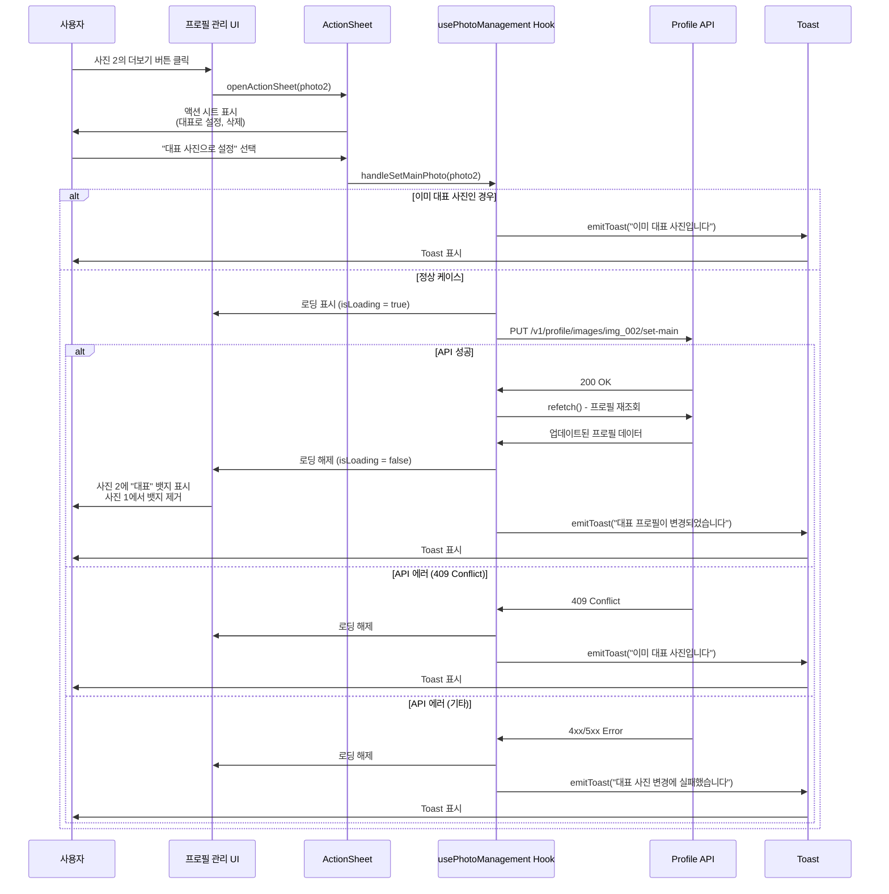
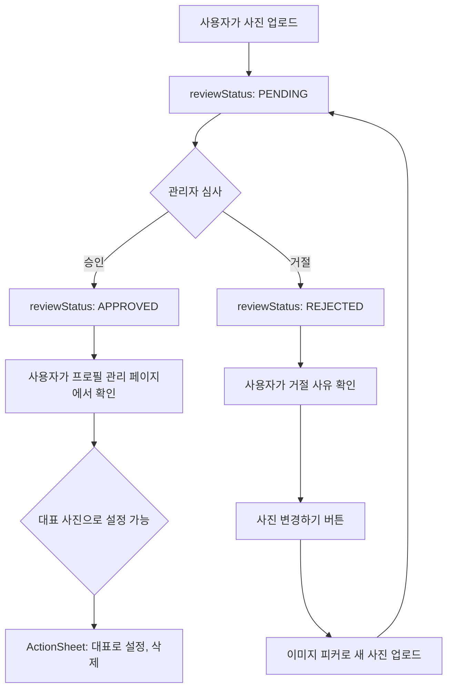

# 프로필 대표 사진 관리 API 가이드

## 목차
1. [개요](#개요)
2. [회원가입 플로우](#회원가입-플로우)
3. [대표 사진 변경 API](#대표-사진-변경-api)
4. [프로필 사진 관리 API](#프로필-사진-관리-api)
5. [에러 처리](#에러-처리)
6. [플로우 다이어그램](#플로우-다이어그램)

---

## 개요

프로필 대표 사진 사용자 지정 기능은 사용자가 여러 프로필 사진 중 매칭 상대에게 먼저 보여질 대표 사진을 선택할 수 있는 기능입니다.

### 주요 특징
- **회원가입 시**: 첫 번째 슬롯(맨 앞 큰 이미지)이 자동으로 대표 사진으로 설정
- **자동 이동**: 2번째 또는 3번째 슬롯에 사진 업로드 시 자동으로 첫 번째 슬롯으로 이동
- **대표 변경**: 프로필 관리 페이지에서 승인된 사진 중 원하는 사진을 대표로 재설정 가능
- **하위 호환성**: 기존 앱에서 mainImageIndex를 전송하지 않아도 백엔드가 자동으로 0번 사진을 대표로 설정

---

## 회원가입 플로우

### 1. 사진 업로드 UI

#### 레이아웃 구조
```
┌─────────────────────────────┐
│ 첫 번째 사진이 대표 사진으로 │
│ 매칭 상대에게 보여집니다     │
└─────────────────────────────┘

┌──────────────┐  ┌─────┐
│              │  │     │
│   [대표]     │  └─────┘
│  (큰 이미지)  │  ┌─────┐
│              │  │     │
└──────────────┘  └─────┘
```

#### 주요 로직
- **첫 번째 슬롯 (index 0)**: 우측 상단에 "대표" 뱃지 표시
- **2/3번째 슬롯 업로드 시**:
  1. 업로드된 이미지를 첫 번째 슬롯(index 0)으로 이동
  2. 기존 첫 번째 이미지가 있으면 두 번째 슬롯(index 1)으로 밀림
  3. Toast 메시지: "대표 사진이 자동으로 설정되었습니다"

### 2. API 요청

#### 엔드포인트
```
POST /v1/auth/signup
```

#### Request (FormData)
```javascript
{
  phoneNumber: string,
  name: string,
  birthday: string,        // YYYY-MM-DD
  gender: "MALE" | "FEMALE",
  age: number,
  universityId: string,
  departmentName: string,
  grade: string,
  studentNumber: string,
  instagramId: string,
  profileImages: File[],   // 최소 1장, 최대 3장
  mainImageIndex: "0",     // 항상 0 (첫 번째 슬롯 고정)
  referralCode?: string,
  kakaoId?: string,
  appleId?: string
}
```

#### Response
```json
{
  "success": true
}
```

#### 구현 코드
```typescript
// src/features/signup/apis/index.tsx
export const signup = (form: SignupForm): Promise<void> => {
  const formData = new FormData();
  // ... 기본 필드 추가

  form.profileImages.forEach((imageUri) => {
    const file = createFileObject(imageUri, `${form.name}-${nanoid(6)}.png`);
    formData.append("profileImages", file);
  });

  // 대표 사진 인덱스는 항상 0
  formData.append("mainImageIndex", "0");

  return axiosClient.post("/auth/signup", formData, {
    headers: { "Content-Type": "multipart/form-data" },
  });
};
```

---

## 대표 사진 변경 API

### 엔드포인트
```
PUT /v1/profile/images/:imageId/set-main
```

### Request

#### Path Parameter
- `imageId` (string, required): 대표로 설정할 프로필 이미지 ID

#### Headers
```
Authorization: Bearer {accessToken}
```

#### Body
없음

### Response

#### 성공 (200 OK)
```json
{
  "success": true,
  "message": "대표 사진이 변경되었습니다"
}
```

#### 에러

**409 Conflict** - 이미 대표 사진인 경우
```json
{
  "success": false,
  "message": "이미 대표 사진입니다"
}
```

**404 Not Found** - 존재하지 않는 이미지 ID
```json
{
  "success": false,
  "message": "프로필 이미지를 찾을 수 없습니다"
}
```

**403 Forbidden** - 승인되지 않은 사진을 대표로 설정하려는 경우
```json
{
  "success": false,
  "message": "승인된 사진만 대표로 설정할 수 있습니다"
}
```

### 사용 시나리오

#### 시나리오 1: 승인된 사진을 대표로 변경
```typescript
// 사용자가 프로필 관리 페이지에서 사진 2를 대표로 설정
const photo2 = { id: "img_002", reviewStatus: "APPROVED", isMain: false };

try {
  await setMainProfileImage(photo2.id);
  // 성공 시 프로필 새로고침
  await refetch();
  emitToast('대표 프로필이 변경되었습니다');
} catch (error) {
  if (error.response.status === 409) {
    emitToast('이미 대표 사진입니다');
  } else {
    emitToast('대표 사진 변경에 실패했습니다');
  }
}
```

#### 시나리오 2: 이미 대표인 사진 재설정 시도
```typescript
const mainPhoto = { id: "img_001", reviewStatus: "APPROVED", isMain: true };

// 프론트엔드에서 미리 체크
if (mainPhoto.isMain) {
  emitToast('이미 대표 사진입니다');
  return;
}

// 또는 API 호출 후 409 에러 처리
```

### 구현 코드

#### API 서비스
```typescript
// src/features/profile/apis/photo-management.ts
export const setMainProfileImage = async (imageId: string): Promise<void> => {
  return axiosClient.put(`/v1/profile/images/${imageId}/set-main`);
};
```

#### 훅 사용
```typescript
// src/features/profile/hooks/use-photo-management.ts
const handleSetMainPhoto = async (photo: ProfileImage) => {
  if (photo.isMain) {
    emitToast('이미 대표 사진입니다');
    return;
  }

  setIsLoading(true);
  try {
    await setMainProfileImage(photo.id);
    await refetch();
    emitToast('대표 프로필이 변경되었습니다');
  } catch (error: any) {
    if (error?.response?.status === 409) {
      emitToast('이미 대표 사진입니다');
    } else {
      emitToast('대표 사진 변경에 실패했습니다');
    }
  } finally {
    setIsLoading(false);
  }
};
```

---

## 프로필 사진 관리 API

### 1. 프로필 조회

#### 엔드포인트
```
GET /v1/profile
```

#### Response
```json
{
  "id": "user_001",
  "name": "김철수",
  "age": 24,
  "profileImages": [
    {
      "id": "img_001",
      "order": 0,
      "isMain": true,
      "url": "https://cdn.example.com/images/img_001.jpg",
      "reviewStatus": "APPROVED"
    },
    {
      "id": "img_002",
      "order": 1,
      "isMain": false,
      "url": "https://cdn.example.com/images/img_002.jpg",
      "reviewStatus": "PENDING"
    },
    {
      "id": "img_003",
      "order": 2,
      "isMain": false,
      "url": "https://cdn.example.com/images/img_003.jpg",
      "reviewStatus": "REJECTED"
    }
  ]
}
```

#### 필드 설명
- `id`: 이미지 고유 ID
- `order`: 순서 (0: 대표, 1: 두 번째, 2: 세 번째)
- `isMain`: 대표 사진 여부
- `url`: 이미지 URL
- `reviewStatus`: 심사 상태
  - `APPROVED`: 승인됨 (보라색 칩)
  - `PENDING`: 심사중 (노란색 칩)
  - `REJECTED`: 거절됨 (빨간색 칩)

### 2. 사진 삭제

#### 엔드포인트
```
DELETE /v1/profile/images/:imageId
```

#### Request

##### Path Parameter
- `imageId` (string, required): 삭제할 프로필 이미지 ID

#### Response

##### 성공 (200 OK)
```json
{
  "success": true,
  "message": "프로필 사진이 삭제되었습니다"
}
```

##### 에러

**400 Bad Request** - 마지막 1장 삭제 시도
```json
{
  "success": false,
  "message": "최소 1장의 프로필 사진이 필요합니다"
}
```

**404 Not Found** - 존재하지 않는 이미지 ID
```json
{
  "success": false,
  "message": "프로필 이미지를 찾을 수 없습니다"
}
```

**403 Forbidden** - 대표 사진 삭제 시도 (선택사항)
```json
{
  "success": false,
  "message": "대표 사진은 삭제할 수 없습니다. 먼저 다른 사진을 대표로 설정해주세요"
}
```

#### 구현 코드
```typescript
// API 서비스
export const deleteProfileImage = async (imageId: string): Promise<void> => {
  return axiosClient.delete(`/v1/profile/images/${imageId}`);
};

// 훅 사용
const handleDeletePhoto = async (photo: ProfileImage) => {
  // 프론트엔드 검증
  if (approvedPhotos.length <= 1) {
    emitToast('최소 1장의 사진이 필요합니다');
    return;
  }

  setIsLoading(true);
  try {
    await deleteProfileImage(photo.id);
    await refetch();
    emitToast('사진이 삭제되었습니다');
  } catch (error) {
    emitToast('사진 삭제에 실패했습니다');
  } finally {
    setIsLoading(false);
  }
};
```

### 3. 사진 변경

#### 엔드포인트
```
PUT /v1/profile/images/:imageId
```

#### Request

##### Path Parameter
- `imageId` (string, required): 변경할 프로필 이미지 ID

##### Body (FormData)
- `image` (File, required): 새로운 이미지 파일

#### Response

##### 성공 (200 OK)
```json
{
  "success": true,
  "message": "프로필 사진이 변경되었습니다",
  "image": {
    "id": "img_001",
    "url": "https://cdn.example.com/images/img_001_new.jpg",
    "reviewStatus": "PENDING"
  }
}
```

---

## 에러 처리

### HTTP Status Code 정리

| Status Code | 의미 | 처리 방법 |
|------------|------|----------|
| 200 | 성공 | Toast로 성공 메시지 표시 |
| 400 | 잘못된 요청 (최소 1장 필요 등) | Toast로 에러 메시지 표시 |
| 403 | 권한 없음 (승인되지 않은 사진 등) | Toast로 에러 메시지 표시 |
| 404 | 리소스 없음 | Toast로 에러 메시지 표시 |
| 409 | 중복 요청 (이미 대표 사진) | Toast로 안내 메시지 표시 |
| 500 | 서버 에러 | Toast로 일반 에러 메시지 표시 |

### 에러 처리 패턴

#### 패턴 1: 프론트엔드 사전 검증
```typescript
// 대표 사진 변경 전 체크
if (photo.isMain) {
  emitToast('이미 대표 사진입니다');
  return;
}

// 사진 삭제 전 체크
if (approvedPhotos.length <= 1) {
  emitToast('최소 1장의 사진이 필요합니다');
  return;
}
```

#### 패턴 2: API 에러 응답 처리
```typescript
try {
  await setMainProfileImage(photo.id);
  await refetch();
  emitToast('대표 프로필이 변경되었습니다');
} catch (error: any) {
  // 특정 에러 코드 처리
  if (error?.response?.status === 409) {
    emitToast('이미 대표 사진입니다');
  } else if (error?.response?.status === 403) {
    emitToast('승인된 사진만 대표로 설정할 수 있습니다');
  } else {
    // 일반 에러
    emitToast('대표 사진 변경에 실패했습니다');
  }
}
```

#### 패턴 3: 낙관적 업데이트와 롤백
```typescript
// 낙관적 업데이트 (선택사항)
const previousPhotos = [...photos];
setPhotosOptimistically(newPhotos);

try {
  await setMainProfileImage(photo.id);
  await refetch();
  emitToast('대표 프로필이 변경되었습니다');
} catch (error) {
  // 에러 시 이전 상태로 롤백
  setPhotos(previousPhotos);
  emitToast('대표 사진 변경에 실패했습니다');
}
```

---

## 플로우 다이어그램

### 1. 회원가입 대표 사진 설정 플로우



### 2. 대표 사진 변경 플로우



### 3. 관리자 승인 플로우 (백엔드)



---

## 하위 호환성

### 기존 앱 동작
- 기존 앱: `mainImageIndex` 파라미터를 전송하지 않음
- 백엔드: 파라미터가 없으면 자동으로 **0번 사진을 대표**로 설정

### 새 앱 동작
- 새 앱: `mainImageIndex: "0"` 명시적으로 전송
- 백엔드: 동일하게 0번 사진을 대표로 설정

### 결론
- **하위 호환성 유지**: 기존 사용자도 앱 업데이트 없이 회원가입 가능
- **명시적 전송**: 새 앱에서는 명확성을 위해 항상 전송

---

## 추가 고려사항

### 1. 이미지 압축
```typescript
// src/shared/libs/image-compression 활용
import { convertToJpeg } from '@/src/shared/utils/image';

const compressedUri = await convertToJpeg(originalUri);
// 압축 설정: maxWidth 1200, quality 0.8
```

### 2. 승인된 사진 수에 따른 혜택
```typescript
const getPhotoCountMessage = () => {
  const count = approvedPhotos.length;
  if (count >= 3) return '상대방 사진을 3장까지 볼 수 있어요';
  if (count >= 2) return '상대방 사진을 2장까지 볼 수 있어요';
  return '상대방 사진을 1장까지 볼 수 있어요';
};
```

### 3. 사진 심사 상태별 UI
| 상태 | 칩 색상 | 액션 |
|------|---------|------|
| APPROVED | 보라색 배경 | 대표 설정, 삭제 가능 |
| PENDING | 노란색 배경 | 심사 중 (액션 불가) |
| REJECTED | 빨간색 배경 | 변경하기 버튼 표시 |

---

## 참고 링크

- [FSD 아키텍처 가이드](https://feature-sliced.design/)
- [React Hook Form 문서](https://react-hook-form.com/)
- [TanStack Query 문서](https://tanstack.com/query/latest)
- [프로젝트 CLAUDE.md](../CLAUDE.md)

---

**작성일**: 2025-12-12
**작성자**: Claude Code
**버전**: 1.0.0
