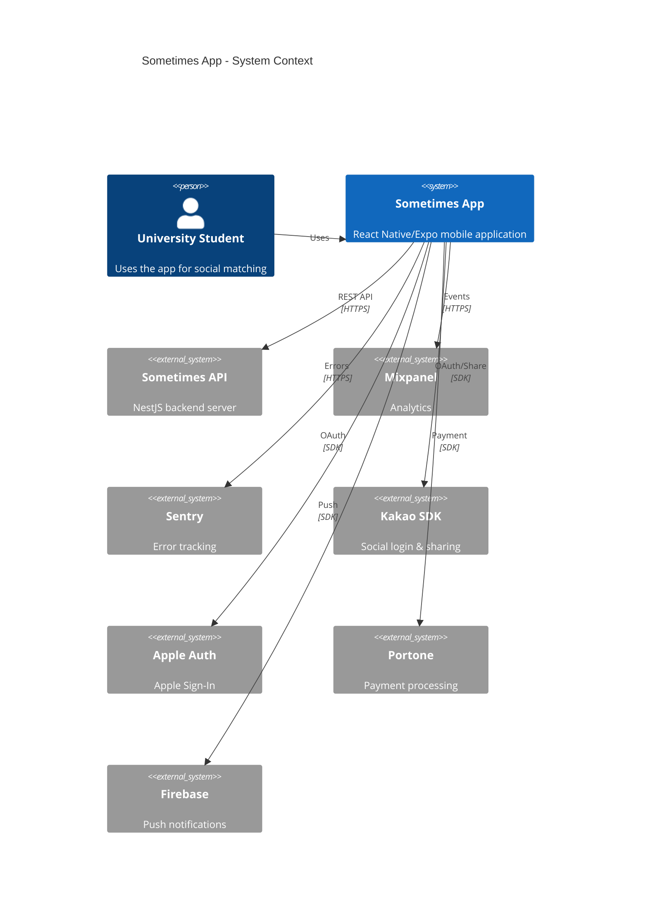
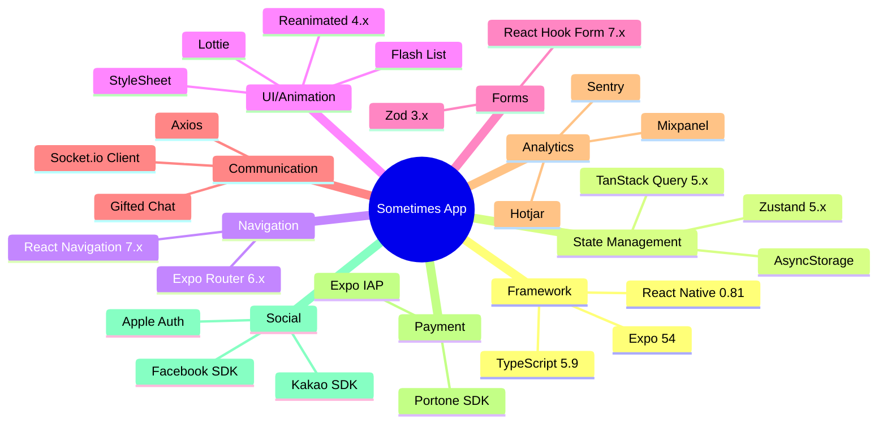
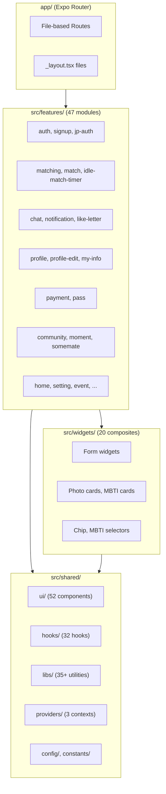
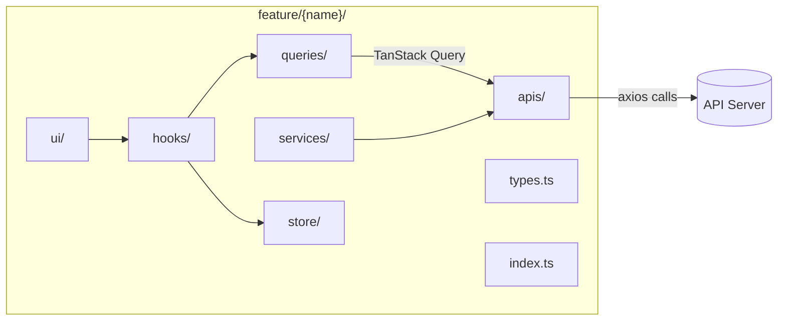
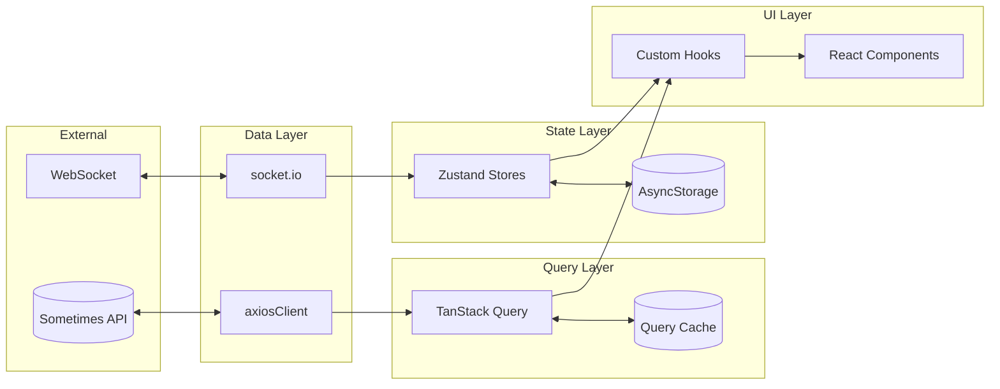

# Sometimes App - System Architecture

## Overview
React Native + Expo mobile application for university student social matching.

## C4 Context Diagram

## Tech Stack

## FSD Architecture Layers

## Feature Module Structure

## Data Flow

## Provider Stack

```mermaid
flowchart TB
    subgraph Root["Root Layout (_layout.tsx)"]
        Sentry["Sentry.wrap()"]
        I18n["I18nextProvider"]
        Gesture["GestureHandlerRootView"]
        Query["QueryProvider"]
        Analytics["AnalyticsProvider (Mixpanel)"]
        Modal["ModalProvider"]
        Portone["PortoneProvider"]
        ChatProvider["GlobalChatProvider"]
        
        subgraph Utilities["Utility Components"]
            Session["SessionTracker"]
            Badge["AppBadgeSync"]
            Login["LoginRequiredModalListener"]
            Version["VersionUpdateChecker"]
            ChatActivity["ChatActivityTracker"]
            Logger["LoggerContainer"]
            Toast["Toast"]
        end
    end
    
    Sentry --> I18n --> Gesture --> Query --> Analytics --> Modal --> Portone --> ChatProvider --> Utilities
```

## Key Integration Points

| Integration | Library | Purpose |
|-------------|---------|---------|
| HTTP Client | axios + interceptors | API calls with token refresh |
| Real-time | socket.io-client | Chat messaging |
| State | Zustand | Global state (matching, chat, notifications) |
| Server State | TanStack Query | Caching, sync, pagination |
| Forms | react-hook-form + zod | Validation, submission |
| Analytics | Mixpanel | User behavior tracking |
| Errors | Sentry | Crash reporting |
| Push | expo-notifications + FCM | Push notifications |
| Payments | Portone + Expo IAP | In-app purchases |
