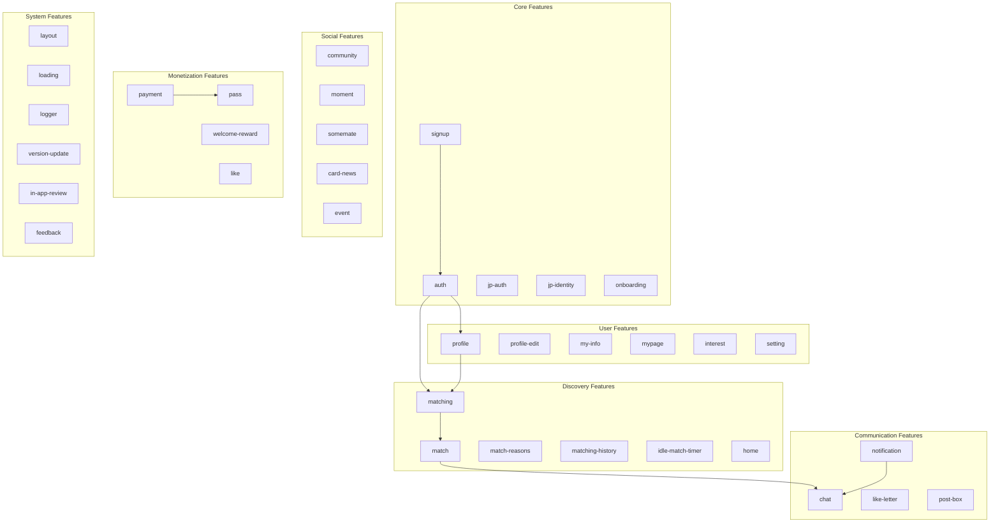
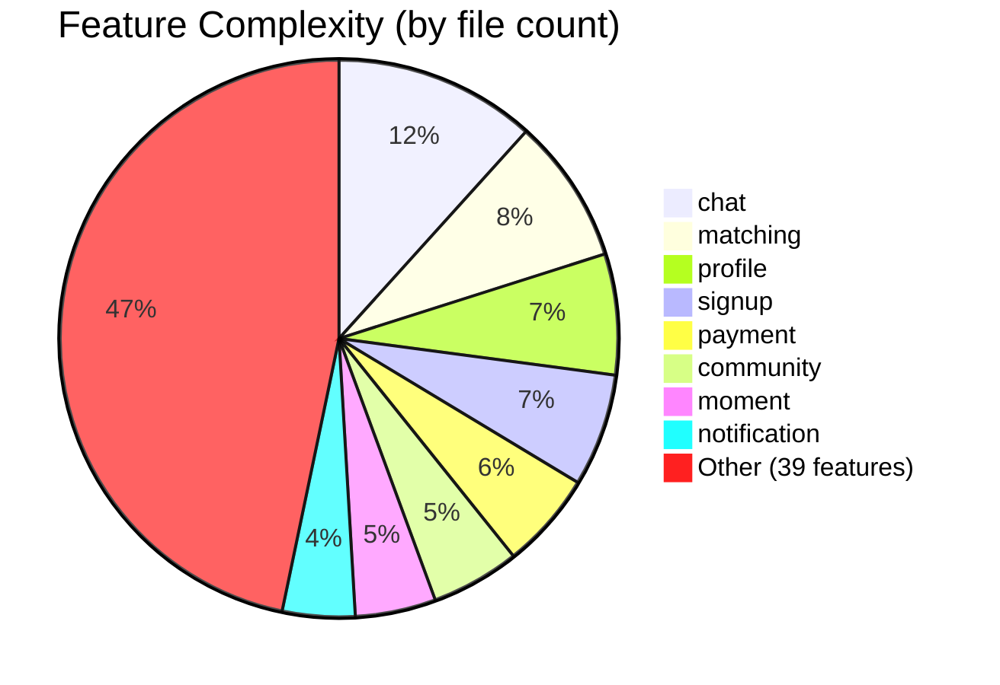
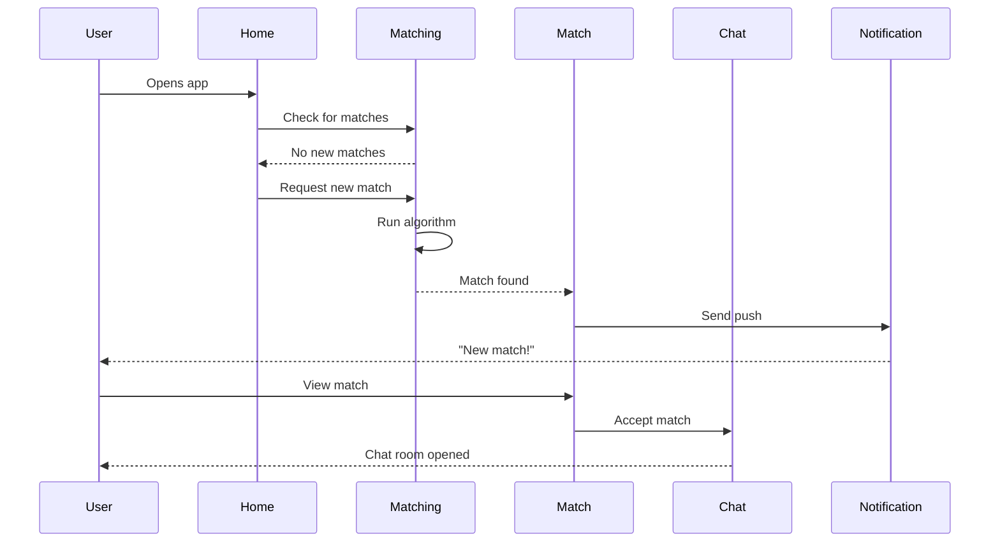

# Sometimes App - Feature Modules Map

## Overview
47 feature modules organized by domain. Each module follows FSD structure.

## Feature Dependency Graph

## Feature Categories

### Authentication (5 modules)

| Feature | Purpose | Key Components |
|---------|---------|----------------|
| `auth` | Login, OAuth, JWT tokens | Login forms, OAuth buttons |
| `signup` | User registration | Multi-step signup wizard |
| `jp-auth` | Japan SMS verification | Phone input, OTP verification |
| `jp-identity` | Japan identity verification | ID upload, verification status |
| `onboarding` | Initial app setup | Tutorial slides, permissions |

### User Management (6 modules)

| Feature | Purpose | Key Components |
|---------|---------|----------------|
| `profile` | View user profiles | Profile cards, photo gallery |
| `profile-edit` | Edit own profile | Form inputs, photo upload |
| `my-info` | Manage personal info | Multi-step form wizard |
| `mypage` | User dashboard | Stats, settings links |
| `interest` | Preference selection | Interest chips, sliders |
| `setting` | App settings | Toggle switches, options |

### Matching & Discovery (6 modules)

| Feature | Purpose | Key Components |
|---------|---------|----------------|
| `matching` | Core matching algorithm | Match cards, swipe UI |
| `match` | Individual match display | Match detail, actions |
| `match-reasons` | Why users matched | Compatibility breakdown |
| `matching-history` | Past matches | History list, filters |
| `idle-match-timer` | Idle state handling | Timer display, refresh |
| `home` | Home feed/dashboard | Feed cards, quick actions |

### Communication (4 modules)

| Feature | Purpose | Key Components |
|---------|---------|----------------|
| `chat` | Real-time messaging | Chat bubbles, input, media |
| `notification` | Push notifications | Notification list, badges |
| `like-letter` | Love letter feature | Letter editor, templates |
| `post-box` | Message inbox | Message list, preview |

### Social (5 modules)

| Feature | Purpose | Key Components |
|---------|---------|----------------|
| `community` | Community/forum | Post list, comments |
| `moment` | Moment questions | Question cards, answers |
| `somemate` | Somemate feature | Partner matching |
| `card-news` | Card-style news | News cards, carousel |
| `event` | Events/promotions | Event banners, details |

### Monetization (4 modules)

| Feature | Purpose | Key Components |
|---------|---------|----------------|
| `payment` | In-app purchases | Gem store, checkout |
| `pass` | Premium subscription | Pass options, benefits |
| `welcome-reward` | Welcome bonuses | Reward display, claim |
| `like` | Like management | Like list, undo |

### System (6 modules)

| Feature | Purpose | Key Components |
|---------|---------|----------------|
| `layout` | Layout wrappers | Container, safe area |
| `loading` | Loading states | Skeletons, spinners |
| `logger` | Error logging | Error boundary, logs |
| `version-update` | Version checking | Update modal, store link |
| `in-app-review` | App store reviews | Review prompt |
| `feedback` | User feedback | Feedback form |

### Other (11 modules)

| Feature | Purpose |
|---------|---------|
| `invite` | Referral system |
| `instagram` | Instagram integration |
| `contact-block` | Block/report users |
| `ban-report` | Report violations |
| `university-verification` | University verification |
| `guide` | Onboarding guides |
| `app-install-prompt` | Install prompt |
| `pre-signup` | Pre-signup flow |
| `admin` | Admin panel |

## Module Internal Structure

```mermaid
flowchart TB
    subgraph FeatureModule["feature/chat/"]
        direction TB
        
        subgraph APIs["apis/"]
            sendMessage["send-message.ts"]
            getMessages["get-messages.ts"]
            uploadMedia["upload-media.ts"]
        end
        
        subgraph Domain["domain/"]
            messageEntity["message.entity.ts"]
            roomEntity["room.entity.ts"]
        end
        
        subgraph HooksDir["hooks/"]
            useChat["use-chat.ts"]
            useSocket["use-socket.ts"]
        end
        
        subgraph Queries["queries/"]
            messagesQuery["messages.query.ts"]
            roomsQuery["rooms.query.ts"]
        end
        
        subgraph Services["services/"]
            chatService["chat.service.ts"]
            socketService["socket.service.ts"]
        end
        
        subgraph Store["store/"]
            chatStore["chat.store.ts"]
        end
        
        subgraph Types["types/"]
            chatTypes["types.ts"]
        end
        
        subgraph UIDir["ui/"]
            ChatRoom["ChatRoom.tsx"]
            MessageBubble["MessageBubble.tsx"]
            ChatInput["ChatInput.tsx"]
        end
        
        subgraph Providers["providers/"]
            chatProvider["GlobalChatProvider.tsx"]
        end
        
        subgraph Utils["utils/"]
            formatMessage["format-message.ts"]
        end
    end
```

## Feature Size Distribution

## Key Feature Interactions

