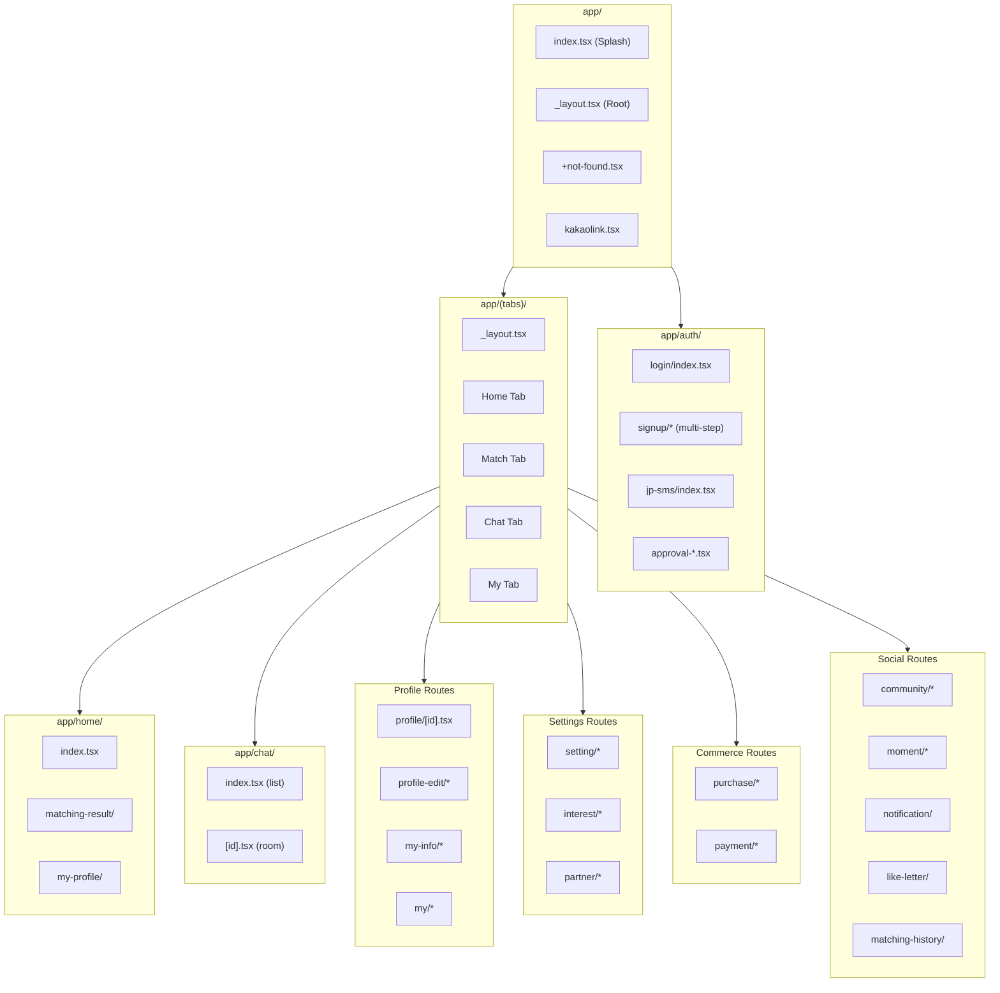
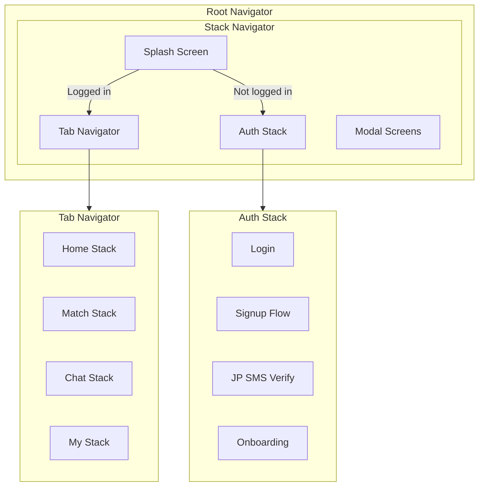
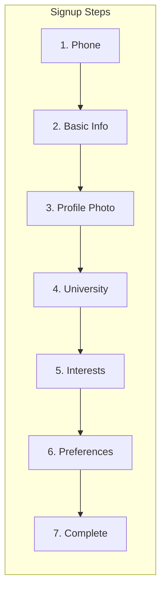
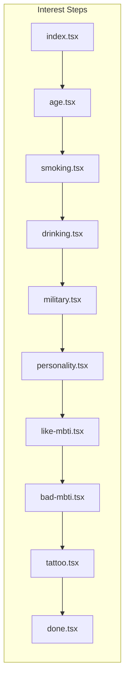
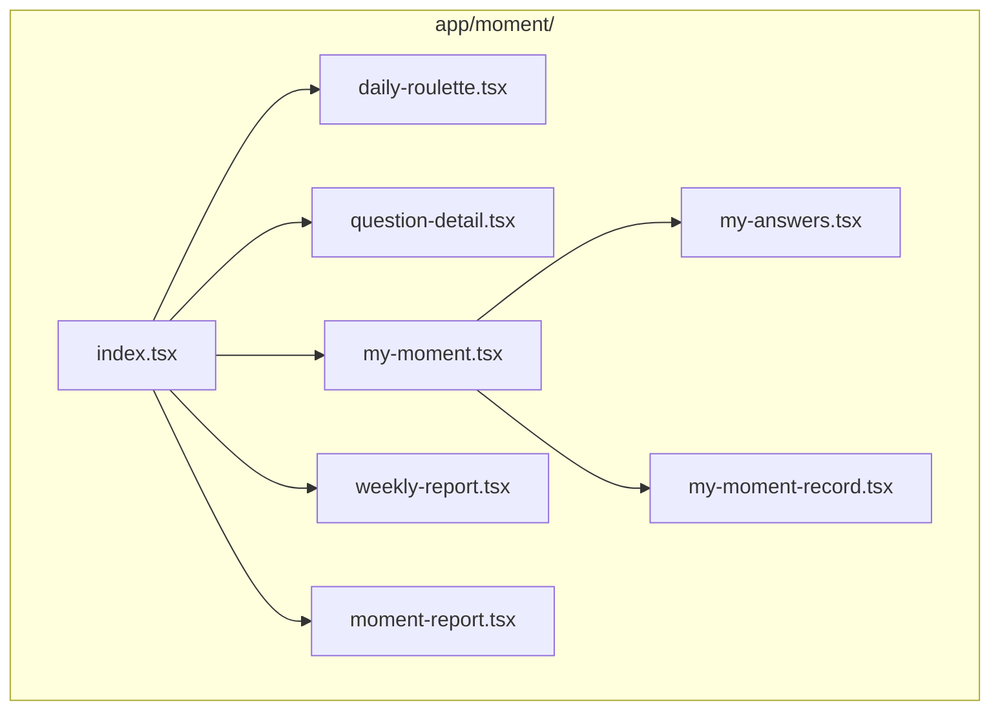
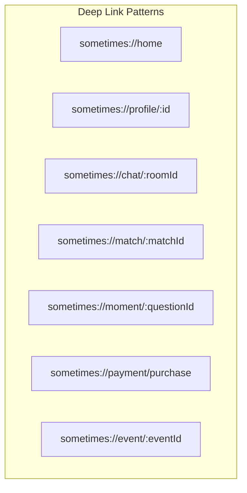
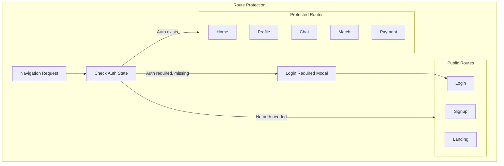

# Sometimes App - Navigation Flow

## Overview
File-based routing using Expo Router 6.x with React Navigation 7.x.

## Route Tree

## Navigation Stack

## Signup Flow (Multi-step)

## Interest Selection Flow

## Moment Feature Routes

## Deep Link Structure

## Route Protection

## Tab Bar Configuration

| Tab | Icon | Route | Badge |
|-----|------|-------|-------|
| Home | house | /(tabs)/home | - |
| Match | heart | /(tabs)/match | Match count |
| Chat | message | /(tabs)/chat | Unread count |
| My | person | /(tabs)/my | - |

## Route File Naming Rules

| Pattern | Purpose | Example |
|---------|---------|---------|
| `index.tsx` | Default route | `chat/index.tsx` → `/chat` |
| `[param].tsx` | Dynamic route | `chat/[id].tsx` → `/chat/123` |
| `_layout.tsx` | Layout wrapper | Wraps child routes |
| `+not-found.tsx` | 404 page | Catch-all |
| `_*.tsx` | Private file | Not a route |
