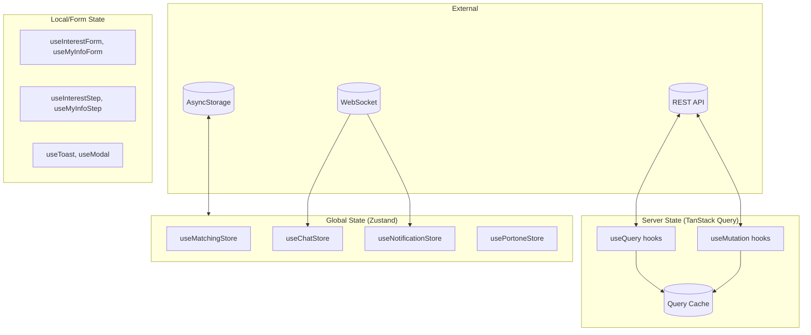
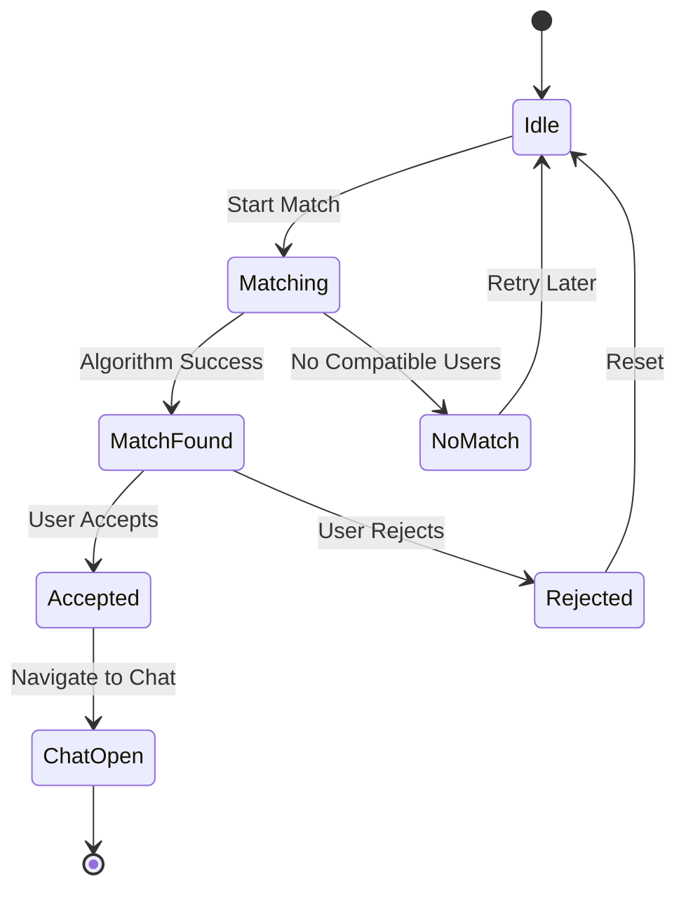
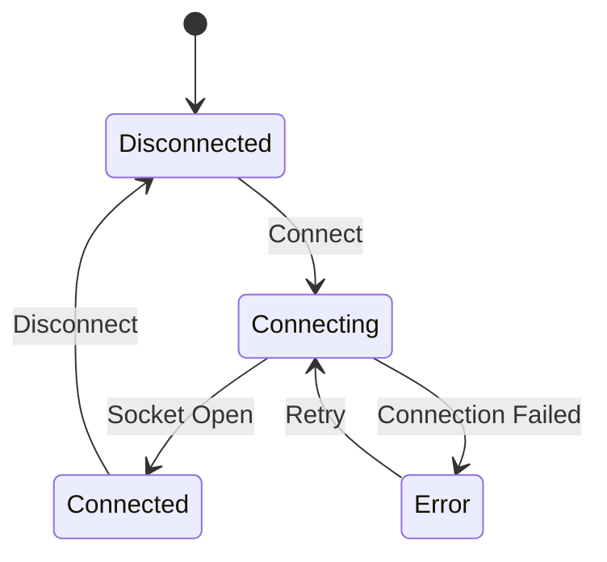
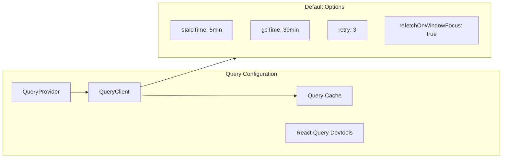
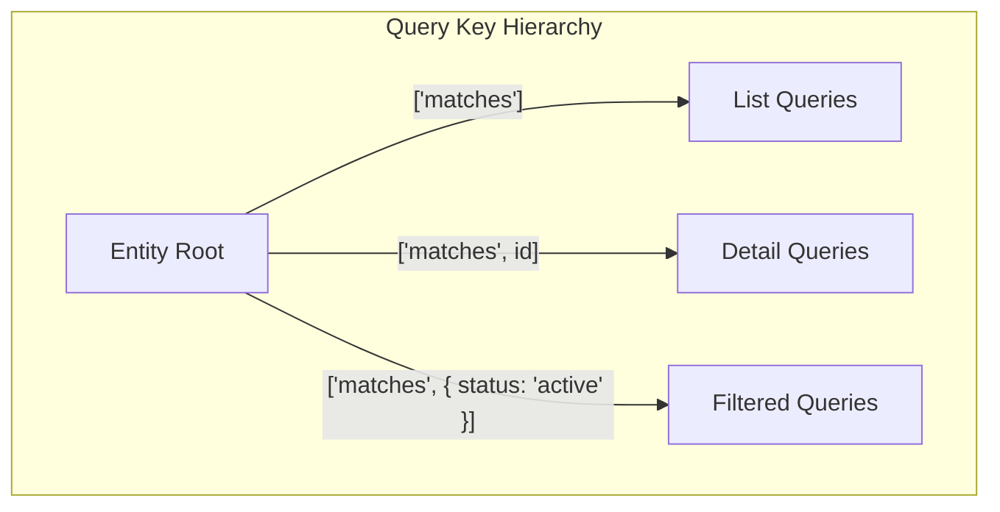
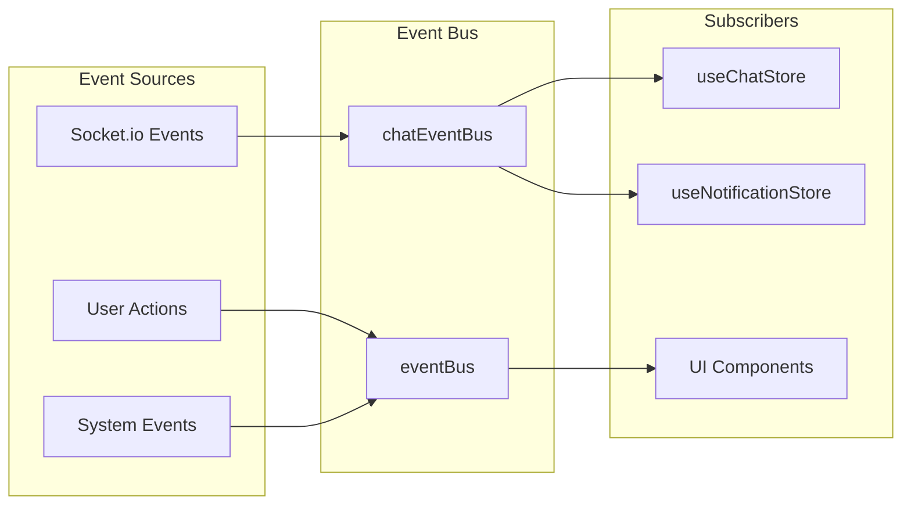
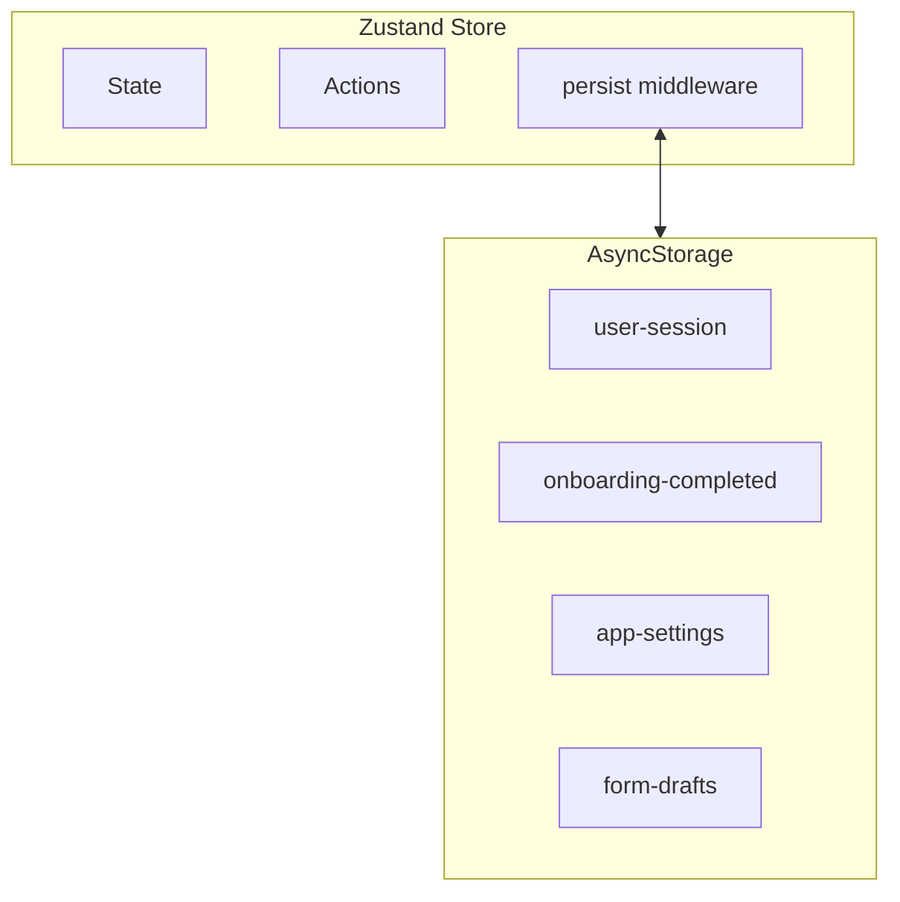

# Sometimes App - State Management

## Overview
Hybrid state management using Zustand for global/local state and TanStack Query for server state.

## State Architecture



## Zustand Stores

### Matching Store



```typescript
// useMatchingStore
interface MatchingState {
  currentMatch: MatchData | null
  currentBadge: BadgeData | null
  userRegion: string
  matchAttempts: number
  
  // Actions
  setCurrentMatch: (match: MatchData | null) => void
  setCurrentBadge: (badge: BadgeData | null) => void
  setUserRegion: (region: string) => void
  incrementMatchAttempts: () => void
  resetMatchAttempts: () => void
  reset: () => void
}
```

### Chat Store



```typescript
// useChatStore
interface ChatState {
  connectionStatus: 'connected' | 'connecting' | 'disconnected' | 'error'
  
  // Synced with chatEventBus events
}
```

### Notification Store

```typescript
// useNotificationStore
interface NotificationState {
  unreadCount: number
  lastNotification: Notification | null
  
  // Actions
  setUnreadCount: (count: number) => void
  setLastNotification: (notification: Notification | null) => void
  incrementUnreadCount: () => void
  decrementUnreadCount: () => void
  reset: () => void
}

// Integrates with appBadgeManager for app icon badge
```

### Payment Store

```typescript
// usePortoneStore
interface PaymentState {
  isProcessing: boolean
  currentOrder: OrderData | null
  paymentMethod: PaymentMethod | null
  
  // Actions
  startPayment: (order: OrderData) => void
  completePayment: () => void
  cancelPayment: () => void
}
```

### Form Stores

```typescript
// useInterestForm & useMyInfoForm
interface FormState<T> {
  data: Partial<T>
  errors: Record<string, string>
  isDirty: boolean
  
  // Actions
  setField: (key: keyof T, value: any) => void
  setErrors: (errors: Record<string, string>) => void
  reset: () => void
}

// useInterestStep & useMyInfoStep
interface StepState {
  currentStep: number
  totalSteps: number
  completedSteps: Set<number>
  
  // Actions
  nextStep: () => void
  prevStep: () => void
  goToStep: (step: number) => void
  markComplete: (step: number) => void
}
```

## TanStack Query Patterns

### Query Configuration



### Query Usage Pattern

```typescript
// Feature-specific query hook
// src/features/{feature}/queries/{name}.query.ts

import { useQuery, useMutation, useQueryClient } from '@tanstack/react-query';
import { getMatches, acceptMatch } from '../apis/matching';

// Query hook
export const useMatches = () => {
  return useQuery({
    queryKey: ['matches'],
    queryFn: getMatches,
    staleTime: 1000 * 60 * 5, // 5 minutes
  });
};

// Mutation hook with cache invalidation
export const useAcceptMatch = () => {
  const queryClient = useQueryClient();
  
  return useMutation({
    mutationFn: acceptMatch,
    onSuccess: () => {
      queryClient.invalidateQueries({ queryKey: ['matches'] });
      queryClient.invalidateQueries({ queryKey: ['chat-rooms'] });
    },
  });
};
```

### Query Key Structure



| Entity | List Key | Detail Key | Filtered Key |
|--------|----------|------------|--------------|
| Matches | `['matches']` | `['matches', matchId]` | `['matches', { status }]` |
| Messages | `['messages', roomId]` | `['messages', roomId, msgId]` | - |
| Profiles | `['profiles']` | `['profiles', userId]` | `['profiles', { filter }]` |
| Notifications | `['notifications']` | `['notifications', id]` | `['notifications', { unread }]` |

## Event Bus Pattern



```typescript
// Chat Event Bus
type ChatEvents = {
  'message:received': (message: Message) => void;
  'message:sent': (message: Message) => void;
  'room:joined': (roomId: string) => void;
  'room:left': (roomId: string) => void;
  'typing:start': (userId: string) => void;
  'typing:stop': (userId: string) => void;
  'connection:change': (status: ConnectionStatus) => void;
};
```

## Storage Persistence



### Persisted Data

| Key | Store | Data |
|-----|-------|------|
| `user-session` | useUserSession | Auth tokens, user ID |
| `onboarding-completed` | useOnboardingCompleted | Boolean flag |
| `matching-store` | useMatchingStore | Current match state |
| `interest-form` | useInterestForm | Form draft data |
| `my-info-form` | useMyInfoForm | Form draft data |

## Shared Hooks for State

| Hook | Type | Purpose |
|------|------|---------|
| `useModal` | UI State | Modal visibility and content |
| `useToast` | UI State | Toast notifications |
| `useBoolean` | Utility | Boolean toggle state |
| `useStorage` | Persistence | AsyncStorage wrapper |
| `useDebounce` | Utility | Debounced values |
| `useTimer` | Utility | Countdown timer |
| `useInfiniteScroll` | Query | Pagination handling |
| `useUserSession` | Auth | User session state |
| `useOnboardingCompleted` | Auth | Onboarding status |
