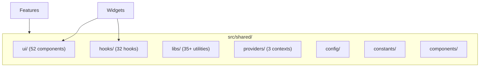
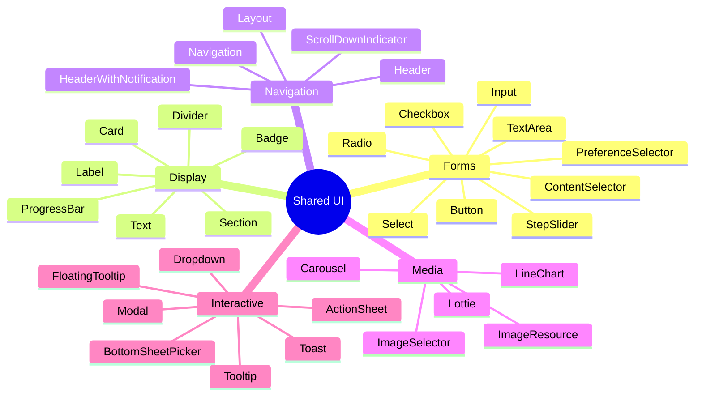
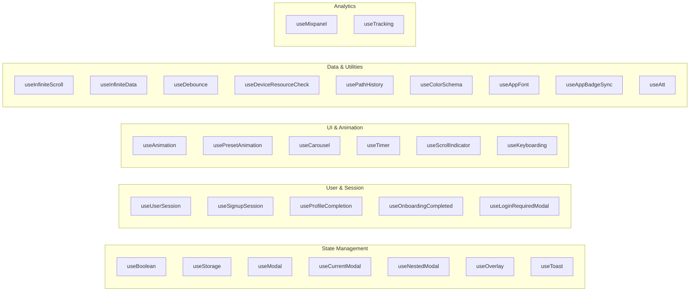
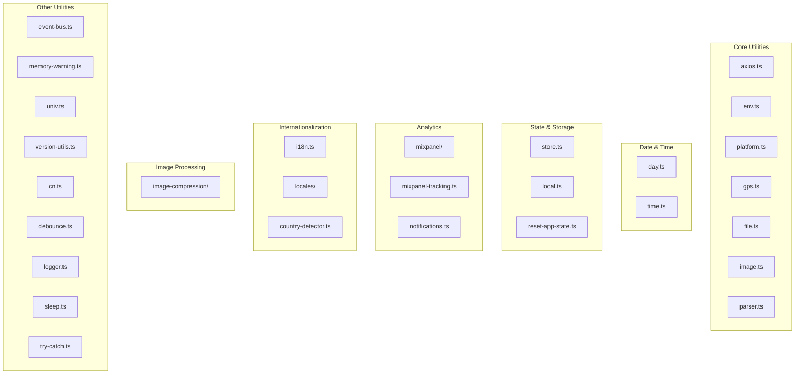
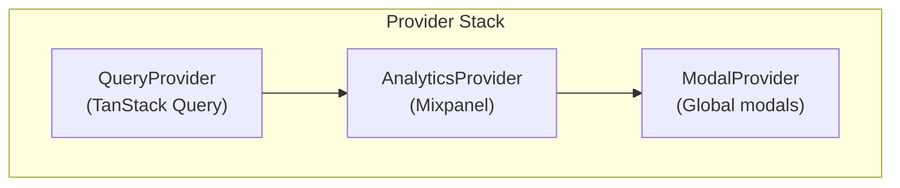
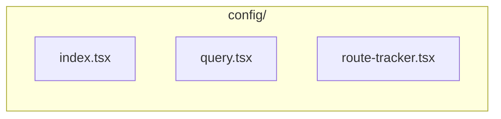

# Sometimes App - Shared Layer

## Overview
Central shared utilities, components, and hooks used across all features.

## Shared Layer Structure



## UI Components (52)

### Component Categories



### Key UI Components

| Component | File | Props | Usage |
|-----------|------|-------|-------|
| `Button` | `button/` | variant, size, disabled, loading | Primary actions |
| `Input` | `input/` | placeholder, error, icon | Text entry |
| `Card` | `card/` | children, style | Content wrapper |
| `Badge` | `badge/` | text, color, size | Tags/labels |
| `Header` | `header/` | title, back, right | Page headers |
| `Toast` | `toast/` | message, type, duration | Notifications |
| `BottomSheetPicker` | `bottom-sheet-picker/` | options, onSelect | Selection sheets |
| `ActionSheet` | `action-sheet/` | actions, onClose | Action menus |

### Component Import Pattern

```typescript
// Barrel export from index
import { Button, Input, Card, Badge } from '@/src/shared/ui';

// Direct import
import { Button } from '@/src/shared/ui/button';
```

## Hooks (32)

### Hook Categories



### Key Hooks Reference

| Hook | Purpose | Returns |
|------|---------|---------|
| `useModal` | Global modal control | `{ showModal, hideModal, isOpen }` |
| `useToast` | Toast notifications | `{ showToast, hideToast }` |
| `useBoolean` | Boolean state | `{ value, setTrue, setFalse, toggle }` |
| `useStorage` | AsyncStorage | `{ value, setValue, remove }` |
| `useDebounce` | Debounced value | Debounced value |
| `useTimer` | Countdown timer | `{ time, start, pause, reset }` |
| `useInfiniteScroll` | Pagination | `{ data, loadMore, hasMore }` |
| `useMixpanel` | Analytics tracking | `{ trackEvent, matchingEvents, ... }` |
| `useUserSession` | Auth state | `{ user, token, isLoggedIn }` |

### Hook Usage Examples

```typescript
// Modal
const { showModal } = useModal();
showModal({
  title: 'Confirm',
  children: <Content />,
  primaryButton: { text: 'OK', onClick: handleOk }
});

// Toast
const { showToast } = useToast();
showToast({ message: 'Saved!', type: 'success' });

// Debounce
const debouncedSearch = useDebounce(searchText, 300);

// Storage
const { value, setValue } = useStorage<User>('user-data');
```

## Libraries (35+)

### Library Categories



### Key Libraries Reference

| Library | Purpose | Key Functions |
|---------|---------|---------------|
| `axios` | HTTP client | axiosClient with interceptors |
| `day` | Date manipulation | dayjs wrapper |
| `storage` | Persistence | AsyncStorage helpers |
| `mixpanel` | Analytics | Track events, identify users |
| `i18n` | Translations | i18next configuration |
| `eventBus` | Events | Pub/sub pattern |
| `image-compression` | Image processing | Compress, resize |
| `cn` | Class names | Tailwind merge utility |

### Axios Configuration

```typescript
// Response interceptor automatically extracts data
const axiosClient = axios.create({
  baseURL: API_URL,
  timeout: 15000,
});

// Interceptor extracts { success, data } → data
axiosClient.interceptors.response.use(
  (response) => response.data.data,
  (error) => handleError(error)
);

// Usage - data is already extracted
const users = await axiosClient.get<User[]>('/users');
// users is User[], not AxiosResponse
```

## Providers (3)



| Provider | File | Purpose |
|----------|------|---------|
| `QueryProvider` | `providers/query.tsx` | TanStack Query client |
| `AnalyticsProvider` | `providers/analytics.tsx` | Mixpanel initialization |
| `ModalProvider` | `providers/modal.tsx` | Global modal state |

## Config



| File | Purpose |
|------|---------|
| `index.tsx` | Config exports |
| `query.tsx` | TanStack Query config |
| `route-tracker.tsx` | Route change tracking for analytics |

## Constants

| File | Purpose | Key Values |
|------|---------|------------|
| `colors.ts` | Color palette | brand, surface, text, state |
| `mixpanel-events.ts` | Event names | MATCHING_SUCCESS, CHAT_SENT, ... |

### Colors Reference

```typescript
import colors from '@/src/shared/constants/colors';

// Legacy (compatibility)
colors.primaryPurple  // #7A4AE2
colors.lightPurple    // #E2D5FF
colors.white          // #FFFFFF

// Semantic (recommended)
colors.brand.primary     // #7A4AE2
colors.surface.background // #FFFFFF
colors.text.primary      // #000000
colors.state.error       // #FF0000
```

## Components (3)

| Component | Purpose |
|-----------|---------|
| `SessionTracker` | Track user session |
| `AppBadgeSync` | Sync app badge count |
| `LoginRequiredModalListener` | Show login modal when needed |

## Import Aliases

```typescript
// Path aliases available
@/           → src/
@features/   → src/features/
@shared/     → src/shared/
@hooks/      → src/shared/hooks/
@ui/         → src/shared/ui/
@widgets/    → src/widgets/
```
